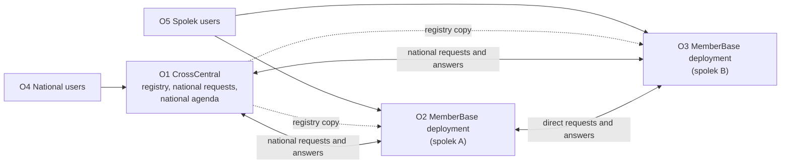
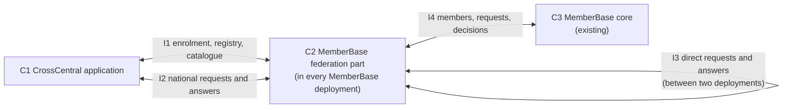
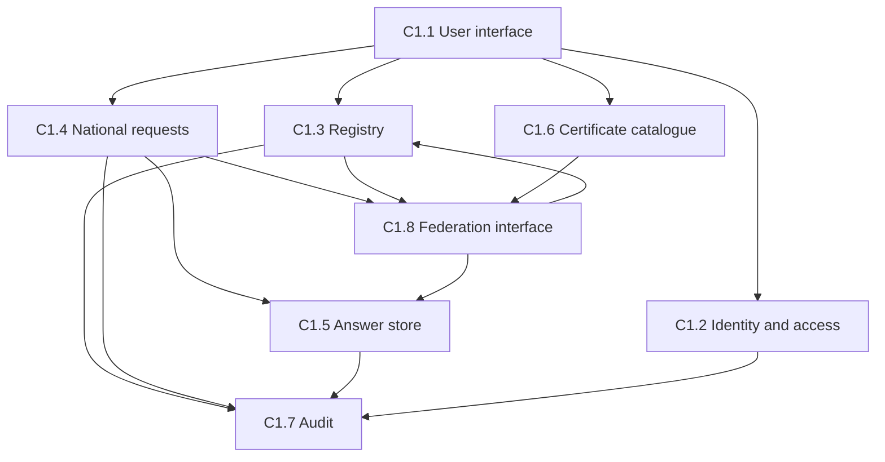
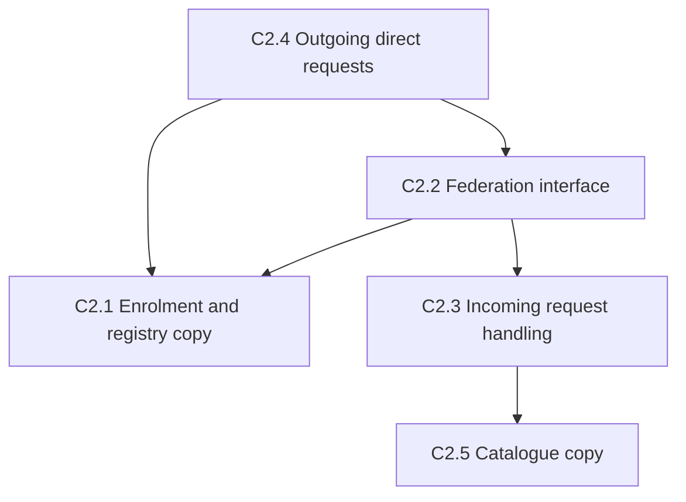
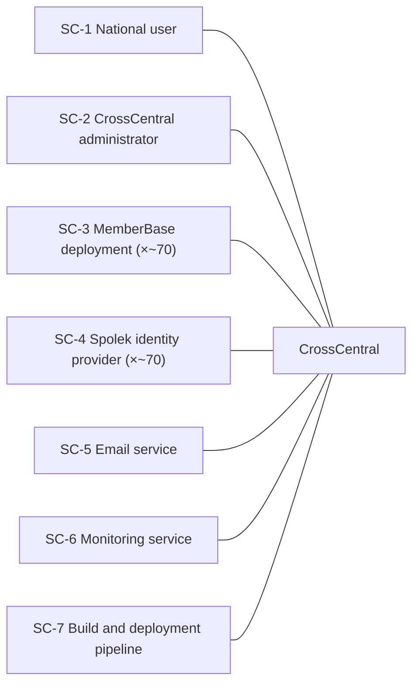
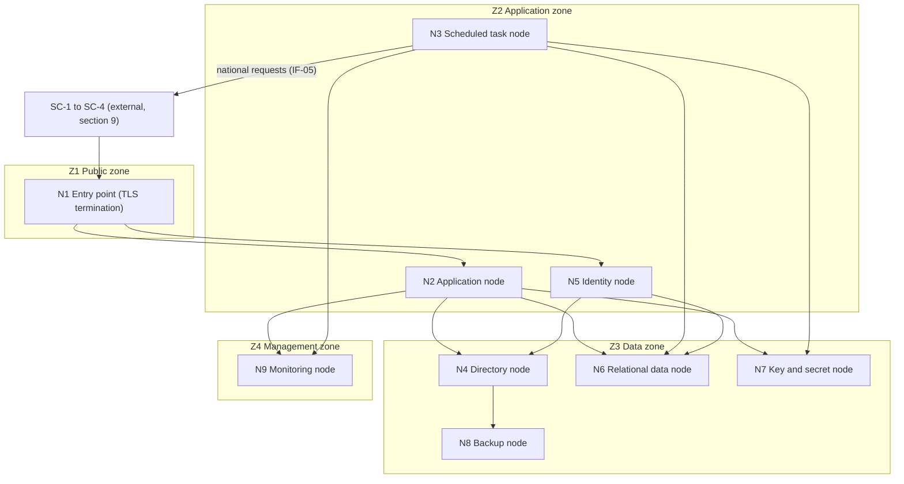
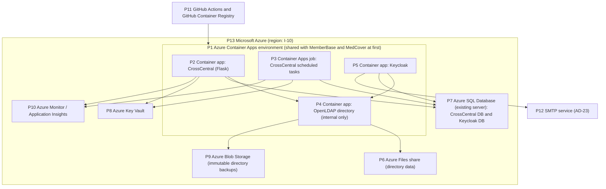

# Architecture Document – CrossCentral

Mode: New, with a short baseline of the MemberBase deployments that
CrossCentral connects. Status: **complete draft for Stakeholder review**
(steps 1–15 of the method done). Last update: Oct 2, 2026.

IDs are stable. Removed items are marked *withdrawn*, never renumbered. The
first draft of this document used one-digit IDs (`FR-1`, `AD-1`, `Q-1`); they
are written with two digits here (`FR-01`, `AD-01`), and the old open
questions are folded into the RAID log with a "was Q-n" note.

## 1. Purpose

The Czech Red Cross (ČČK) is organised as a national society with about 70
Oblastní spolky, each a separate legal entity that owns its members' data,
and each with Místní skupiny below it. Every Oblastní spolek runs its own MemberBase
deployment. The national level, starting with Úřad ČČK, has no system of its
own.

The Stakeholder is, for now, the lead of the team that builds MemberBase and
MedCover, acting as intermediary towards the national headquarters. When an
agreement with the headquarters is made, the Stakeholder role may pass to it
officially. Úřad ČČK is the first user.

Two needs drive CrossCentral. First, national bodies, above all the Ústřední krizový
tým, must be able to reach the right members quickly, typically the
contacts of members holding a given certificate in one kraj during a crisis.
Second, spolky need to exchange requests with each other (for example
access to named people), and isolated MemberBase deployments cannot find or
trust each other.

The goal of CrossCentral is to make every MemberBase deployment findable and
verifiable, to let national bodies request member data through a controlled
flow in which the owner of the data decides what leaves, and to give
the national level a home for its own work: first its users and roles, later
internal regulations and brand material.

Business processes supported: crisis response coordination by the ÚKT,
membership administration between spolky, and the national office's
administration of national-level users and of the certificate catalogue.

## 2. Requirements

### 2.1 Use cases / scenarios

| ID | Name | Actor(s) | Goal | Main flow | Related FRs |
|----|------|----------|------|-----------|-------------|
| UC-01 | Enrol a MemberBase deployment | Spolek administrator, CrossCentral administrator | A spolek's MemberBase deployment joins the federation | 1. The spolek administrator starts enrolment in MemberBase, which creates the deployment's credential. 2. MemberBase submits the enrolment (district ID, name, kraj, endpoint, public credential, supported request kinds) to CrossCentral. 3. A CrossCentral administrator checks it and approves it. 4. The deployment appears in the registry and receives the registry copy. | FR-01, FR-02, FR-05, FR-25 |
| UC-02 | Suspend or remove a deployment | CrossCentral administrator | Stop a deployment from taking part, e.g. after a compromised credential | 1. The administrator suspends or removes the deployment. 2. Its credential stops being accepted. 3. The updated registry reaches all deployments. | FR-03, FR-25 |
| UC-03 | Watch deployment health | CrossCentral administrator | See which deployments are reachable and up to date | 1. The administrator opens the registry. 2. Each deployment shows last contact, software and protocol version. | FR-04 |
| UC-04 | Send a crisis contact-list request | ÚKT member | Get contacts of members with given certificates in a kraj, a list of spolky or the whole country | 1. The ÚKT member picks the request kind, targets, criteria (national certificate codes), data level, purpose, expiry and answer retention. 2. CrossCentral delivers the request to each target deployment. 3. Each Místní skupina's approver decides its part (UC-05). 4. The ÚKT member sees per-target status and the answers received so far. 5. They view the answers on screen or export them. 6. The answers are purged when their retention ends (UC-09). | FR-05, FR-06, FR-08, FR-11, FR-12, FR-13, FR-14, FR-15, FR-16 |
| UC-05 | Decide an incoming request | MS Chair, District Coordinator, OS Chair | The owner of the data decides what leaves | 1. The request appears in MemberBase „Žádosti“, split per Místní skupina. 2. The approver for that part (FR-24) sees requester, purpose, criteria and data level. 3. They approve all, some or none of the matching people. 4. MemberBase sends the approved part of the answer back to the requester. | FR-09, FR-10, FR-24 |
| UC-06 | Request named people from another spolek | MemberBase user (in the requesting spolek) | Get access to or data of named people of another spolek | 1. The user files the request in their MemberBase. 2. Their MemberBase finds the target deployment in its registry copy and sends the request directly to it. 3. The target decides it (UC-05). 4. The answer goes directly back. CrossCentral takes no part beyond the registry. | FR-07, FR-08, FR-09, FR-10, FR-25 |
| UC-07 | Maintain the national certificate catalogue | Úřad ČČK staff | One definition of each certificate for the whole country | 1. Staff add or change a certificate definition with a stable code. 2. Deployments receive the updated catalogue. 3. Requests use the codes as criteria. | FR-16 |
| UC-08 | Manage CrossCentral users and roles | CrossCentral administrator | Give the right people the right rights | 1. The administrator creates a local account or admits a person logging in with their spolek account. 2. They assign roles, scoped to the whole country or one kraj. 3. The person logs in with a second factor where the role requires it. | FR-17, FR-18, FR-19, FR-26 |
| UC-09 | Purge expired answers | CrossCentral or the requesting MemberBase deployment (scheduled) | Keep personal data no longer than needed | 1. A scheduled task finds answers whose retention has ended. 2. It deletes the payloads and keeps the metadata. 3. The purge is audited. | FR-14, FR-15 |

### 2.2 Functional requirements

| ID | Requirement | MoSCoW | Source | Notes |
|----|-------------|--------|--------|-------|
| | **Registry of MemberBase deployments** | | | |
| FR-01 | CrossCentral keeps a registry of all MemberBase deployments in the country: district ID, Oblastní spolek name, IČO, kraj, base URL, contact person, protocol version, status. | Must | Stakeholder | |
| FR-02 | A deployment joins the registry only through an enrolment step approved by a CrossCentral administrator; no deployment registers itself silently. | Must | Stakeholder | UC-01 |
| FR-03 | A deployment can be suspended or removed from the registry; a suspended deployment can neither send nor receive requests. | Must | Stakeholder | UC-02 |
| FR-04 | The registry shows each deployment's health: last contact, software version and protocol version. | Should | Stakeholder | UC-03 |
| FR-05 | Each Oblastní spolek belongs to exactly one kraj; a request can target a kraj, a list of Oblastní spolky or the whole country. | Must | Stakeholder | |
| | **Requests between deployments** | | | |
| FR-06 | An authorised CrossCentral user (e.g. a ÚKT member) sends a member-data request to one or more Oblastní spolky, with criteria (certificate, role, status, Místní skupina) and the data wanted, expressed in MemberBase visibility levels (`basic`, `contact`, `extended`, `records`). | Should | Stakeholder | First kind: crisis contact list (was Q-6). Travels over the same direct protocol as FR-07, with CrossCentral acting as one more participant. |
| FR-07 | MemberBase deployments exchange requests directly with each other; they find each other and verify each other's identity through the CrossCentral registry. CrossCentral learns nothing about these requests. | Should | Stakeholder | Reworded: the first draft routed these through CrossCentral. First kind: access to named people of another spolek (was Q-6). |
| FR-08 | Only predefined request kinds exist; there are no free-form queries. | Must | Stakeholder (product rule) | |
| FR-09 | A request is answered only after an authorised person of the source spolek has approved it. Whether some future request kinds may be answered without approval is open. | Should | Stakeholder | Both first kinds release personal data and need approval. Open point: I-02. |
| FR-10 | The receiving spolek sees incoming requests in MemberBase „Žádosti“ and decides them (approve all, some or none of the matching people). | Must | Stakeholder | |
| FR-11 | The requester sees per-target status (delivered, pending, approved, rejected, expired, failed) and the answers received so far; partial answers are usable before all targets reply, so one slow spolek or Místní skupina does not block the rest. | Must | Stakeholder | Reworded: partial answers. |
| FR-12 | Every request states its purpose and has an expiry; unanswered requests expire. | Should | Stakeholder | |
| FR-13 | Answers can be viewed on screen and exported as XLSX. | Must | Stakeholder | Views are not audited; exports are (FR-15). |
| FR-14 | Answers are removed from the participant that received them (CrossCentral, or the requesting MemberBase deployment for direct requests) when the retention period set in the request ends (default 30 days). | Must | Stakeholder | Extended to direct requests in step 6. |
| FR-15 | Every step of a request (sent, delivered, decided, answered, exported, purged) is audited with who, when and which deployment. Viewing is not audited. | Must | Stakeholder | For a decision, the requester's side records only the approver's role and Místní skupina; the deciding deployment's own audit records the person (P-02). |
| FR-24 | A request aimed at members is split per Místní skupina; each part is decided by the MS Chair, or by the District Coordinator when the Místní skupina has no Chair or is run by the Coordinator. A request kind aimed at the spolek itself is decided by an OS Chair or the District Coordinator, as the kind defines. | Must | Stakeholder (was Q-2) | The OS Chair role does not exist in MemberBase yet (I-05). |
| FR-25 | CrossCentral publishes the registry (deployment endpoints, public credentials, supported request kinds and versions, status) to enrolled deployments, which keep a local copy. | Must | Derived from FR-07 and NFR-05 | |
| | **National catalogue of certificates** | | | |
| FR-16 | Certificates and qualifications that requests can ask about are defined once nation-wide with stable codes, and every MemberBase deployment uses those definitions. | Must | Stakeholder (product rule) | Owner of the catalogue: I-06. |
| | **National user register and access** | | | |
| FR-17 | CrossCentral has its own register of the people who use it, with roles and permissions in the application. First release: Úřad ČČK staff and ÚKT members. | Must | Stakeholder (was Q-12) | Administered by the development and operations team at first (I-04). |
| FR-18 | Roles can be scoped to the whole country or to one kraj; a person with a kraj-scoped role works only on that kraj. | Must | Stakeholder | Regional crisis teams are not first-release users, but kraj-scoped roles are built in the first release. |
| FR-19 | Login with single sign-on, time-based one-time passwords and passkeys; a second factor is mandatory for administrators and for anyone who can request member data. | Must | Derived from MemberBase | |
| FR-26 | People log in either with their spolek's MemberBase account (brokered from the spolek's identity provider) or with a CrossCentral-local account. | Must | Stakeholder (was Q-3) | |
| | **Later** | | | |
| FR-20 | Knowledge base: articles and documents (internal regulations, practical guides) with versions, categories, search and per-role visibility. | Could | Stakeholder | |
| FR-21 | Brand repository: official logos in all variants and formats, the visual manual, colours and fonts, downloadable by members. | Could | Stakeholder | |
| FR-22 | Logo generator: produce a correct logo for a named branch following the visual rules; output SVG, PDF and PNG. | Could | Stakeholder | |
| FR-23 | Another national society can run its own CrossCentral deployment with its own regions, organisation levels and language. | Could | Stakeholder | No translation preparation now (was Q-8, see NFR-01). |

### 2.3 Non-functional requirements

| ID | Category | Requirement | MoSCoW | Source | Notes |
|----|----------|-------------|--------|--------|-------|
| NFR-01 | Localisation | All UI, emails and generated documents are in Czech; code, repository and documentation are in English. The UI is not prepared for translation. | Must | Stakeholder (was Q-8) | |
| NFR-02 | Maintainability / skills | CrossCentral uses the same stack, tooling and conventions as MemberBase and MedCover, so the same small team can build and operate it. | Should | Stakeholder | Deviations need an AD. |
| NFR-03 | Privacy | Each Oblastní spolek remains the owner of its members' data; nothing leaves it without approval by the responsible person of the Místní skupina, or by the District Coordinator for a Místní skupina that the Coordinator runs. | Should | Stakeholder | Subject to FR-09's open point. |
| NFR-04 | Privacy | Data minimisation: CrossCentral stores only what a request needs, for a bounded time; metadata outlives payloads. | Must | Stakeholder | |
| NFR-05 | Availability | MemberBase keeps working, including local requests and direct requests between deployments, while CrossCentral is down, using its last copy of the registry; national requests resume when CrossCentral is back. | Must | Stakeholder | Reworded for direct traffic. |
| NFR-06 | Security | Every deployment, and CrossCentral itself, authenticates with its own credential, which can be revoked without affecting the others. | Must | Stakeholder | |
| NFR-07 | Security | Encryption in transit on every connection; no secrets in the repository; real deployment details only in the private infrastructure repository. | Must | Stakeholder | |
| NFR-08 | Maintainability | The protocol between deployments is versioned; CrossCentral and each MemberBase deployment upgrade independently. | Must | Stakeholder | |
| NFR-09 | Scalability | Sized for about 70 Oblastní spolky, tens of thousands of members in total and tens to low hundreds of CrossCentral users. | Should | Stakeholder | |
| NFR-10 | Availability | Reachable 24/7 without a high-availability setup; in a crisis a ÚKT member can send a request within minutes. | Must | Stakeholder | |
| NFR-11 | Maintainability | 100 % line and branch test coverage. | Must | Stakeholder | |
| NFR-12 | Cost / licensing | Only open-source software components without licence fees. Managed Azure platform services are allowed within the budget (NFR-18, NFR-19). | Must | Stakeholder | Hosting constraint split out to NFR-19. Scope clarified by I-08. |
| NFR-13 | Compliance | Processing complies with GDPR; the open points (I-03) are resolved with the data protection officer before the first real request. | Must | Stakeholder | |
| NFR-14 | Backup and DR | Recovery point objective 1 day, recovery time objective 12 hours, as MemberBase. | Must | Stakeholder | |
| NFR-15 | Performance | Interactive pages respond in about 2 seconds or less at the scale of NFR-09, as MemberBase. No throughput target beyond NFR-09. | Should | Stakeholder | |
| NFR-16 | Observability | Platform logs and metrics, a health endpoint, and alerts to the operations team on outage and on failed scheduled tasks, as MemberBase. No 24/7 on-call. | Should | Stakeholder | |
| NFR-17 | Usability / devices | Responsive UI usable on desktop and mobile phones; basic accessibility as MemberBase. | Should | Stakeholder | |
| NFR-18 | Cost / budget | Running cost of the same order as one MemberBase deployment; no paid extras without an AD. | Must | Stakeholder | |
| NFR-19 | Constraint (hosting) | Hosted on Microsoft Azure. | Must | Stakeholder | Reason: budget. Which Azure services: AD. |
| NFR-20 | Data retention | Audit records (metadata, no payloads) are kept for the same period as MemberBase's change log: 10 years. | Must | Stakeholder | Answer payloads: FR-14. |
| NFR-21 | Other constraints (timeline) | No fixed delivery date; work proceeds at the team's pace. | Not applicable | Stakeholder | Recorded so the category is covered. |

## 3. Baseline architecture

This section describes the MemberBase landscape as it exists today, which
CrossCentral connects. It is generic: real deployments are described only in
the private infrastructure repository.

### 3.1 Overview

Every Oblastní spolek runs its own, self-contained MemberBase deployment.
Deployments do not know about each other, and there is no national system.
Communication between deployments was explicitly left out of MemberBase, but
identifiers were prepared for it.

### 3.2 Components of one deployment

| Component | Description |
|-----------|-------------|
| Directory (OpenLDAP) | System of record for people, Místní skupiny, roles, certificates, qualifications, visibility grants and requests. Access rules in the directory decide what each person may see or change; the app reads and writes as the logged-in person (LDAP proxied authorization). The `accesslog` overlay keeps the change history, purged after 10 years. |
| Identity provider (Keycloak) | The only login: password, TOTP and passkeys over OIDC; a second factor is mandatory for administrator roles. Its users come from the directory. |
| MemberBase application (Flask) | Administers the directory: members, Místní skupiny, roles, grants, invitations, history, and requests („Žádosti“). |
| Scheduled jobs | Run every 15 minutes: expire grants, repair group memberships. |
| MedCover | Event staffing application; an OIDC client of the deployment's identity provider. Developed separately, with its own SQL database. |

Concepts relevant to CrossCentral:

- **Visibility levels** `basic`, `contact`, `extended`: people see their own
  Místní skupina at the `contact` level; anything else needs a grant. The
  District Coordinator reads the whole spolek, MS Chairs change the people of
  their own Místní skupina.
- **Requests („Žádosti“)** exist inside one deployment: filed by one person,
  decided by the Chair of the owning Místní skupina, carried out by MemberBase
  with its service account (an agreed exception to the „runs as the person“
  rule).
- **Identifiers:** each deployment carries a district ID; people, units and
  qualifications have UUIDs, so they are unique across deployments.
- **Certificates and qualifications** are defined per deployment; there is no
  national catalogue.

### 3.3 Context and integrations

A deployment integrates with its own users (browser), its own MedCover
instance (OIDC), an email service and its backup storage. There is no
integration between deployments and none with a national system.

### 3.4 Deployment

Each deployment is a set of containers on Azure Container Apps (directory,
identity provider, application, scheduled job), in one Container Apps
environment shared with MedCover. The directory has persistent storage on
Azure Files, runs as exactly one replica and is reachable only inside the
environment; the application and the identity provider have public HTTPS
ingress. The identity provider's database is on Azure SQL. The directory
is backed up every night to Blob storage with a time-based immutability
policy and deleted after 30 days. Development and operations are done by one
small volunteer team.

### 3.5 Known problems relevant to CrossCentral

- National bodies cannot reach members across spolky except by asking each
  spolek by hand.
- Deployments cannot find or authenticate each other.
- Certificate definitions differ per deployment, so the same question can
  mean different things in different spolky.
- The national level has no user register, no roles and no audit of what
  member data it receives.

## 4. Architecture principles

Confirmed by the Stakeholder. Requirements that were considered as
principles but not chosen (predefined request kinds, independent
deployments, reuse of the team's stack) remain requirements (FR-08,
NFR-05, NFR-08, NFR-02).

| ID | Name | Statement | Rationale | Implications |
|----|------|-----------|-----------|--------------|
| P-01 | Data stays with its owner | Member data lives in the Oblastní spolek's MemberBase and leaves it only through a request that the person responsible for that data has approved. | Each spolek is a separate legal entity and owns its members' data (NFR-03); approval is decided per Místní skupina (FR-09, FR-10, FR-24). | CrossCentral is never a second copy of the member register; answers are produced and approved at the source; nothing is fetched behind the approver's back. |
| P-02 | Minimise personal data | Collect, transfer and store only the personal data a request needs, for the shortest time that serves its purpose; metadata outlives payloads. | Data minimisation and retention requirements (NFR-04, FR-14); GDPR (NFR-13). | Data levels and criteria from closed lists; answers purged by their retention period; registry and audit hold no member data. |
| P-03 | Secure and audited by design | Every party authenticates with its own revocable credential, people with sensitive rights use a second factor, every connection is encrypted, rights are the least needed, and every movement of personal data is audited. | Security requirements (NFR-06, NFR-07, FR-19) and audit (FR-15, NFR-20). | Security is part of each design decision, not added later; each component has its own identity; audit records are written for every request step. |
| P-04 | GDPR compliance | Processing of personal data is lawful, transparent and accountable, and the design does not move ahead of the decisions of the data protection officer. | Compliance requirement (NFR-13); personal data crosses organisational boundaries (I-03). | Open GDPR points block real requests (D-02); each request kind gets a data protection review; roles of controller and processor shape the data flows. |
| P-05 | Open source, low cost | Use only open-source components without licence fees, and keep running cost of the order of one MemberBase deployment. | Licensing and budget constraints (NFR-12, NFR-18, NFR-19). | Commercial or closed products are excluded; paid platform services need an AD showing they fit the budget. |
| P-06 | Keep it simple | Choose the fewest components and moving parts that meet the requirements; build nothing "just in case". | One small volunteer team builds and runs three applications (R-03); no high availability needed (NFR-10). | Prefer one application over several services, scheduled tasks over always-on workers, and existing building blocks over new ones; "Could" features must not shape the first release. |

## 5. Architecture overview

### 5.1 Architecture type

The solution is a **federation of independent deployments** with one central
node:

- Every Oblastní spolek runs its own MemberBase deployment, which remains the
  only place where its member data is kept (P-01).
- CrossCentral is the central node. It is the **registry and trust anchor**
  of the federation: deployments enrol with it, and it publishes who the
  participants are, where they are and how to verify them (FR-01 to
  FR-05, FR-25).
- Requests travel **directly between participants** over one versioned
  protocol (FR-07, NFR-08). CrossCentral takes part in that protocol as a
  participant like any MemberBase deployment when it sends national requests
  (FR-06). It sees nothing of requests between two MemberBase deployments.
- Within CrossCentral, one **modular web application** serves the federation
  functions and the national agenda (user register, certificate catalogue,
  later knowledge base and brand material), so a small team has one thing to
  build and operate (P-06, NFR-18).

Why: a federation keeps data with its owner and lets every deployment run
and fail on its own (P-01, NFR-05). Direct exchange keeps CrossCentral out
of the path of data between spolky, as the Stakeholder decided (FR-07). A
single central node is still needed, because participants must find and
trust each other and national bodies need one place to work from.

| No. | Item | Description |
|-----|------|-------------|
| O1 | CrossCentral | Central node: registry and trust anchor, sender of national requests, national agenda. |
| O2, O3 | MemberBase deployment | One per Oblastní spolek; owner of its members' data; receives, decides and answers requests; sends direct requests to other deployments. Two shown, about 70 exist. |
| O4 | National users | Úřad ČČK staff and ÚKT members (first release), later regional crisis teams. |
| O5 | Spolek users | Members, MS Chairs, District Coordinators and administrators of a spolek, working in their own MemberBase. |

### 5.2 Key design considerations

- **Data ownership and approval (P-01, P-04).** Answers are assembled and
  approved at the source, per Místní skupina (FR-24), and leave only after
  approval (FR-09). Partial answers flow back as each part is decided
  (FR-11).
- **Minimal central data (P-02).** CrossCentral holds the registry, national
  users and roles, the certificate catalogue, the audit trail, and the
  answers to national requests until their retention ends (FR-14). It holds
  no copy of any member register.
- **Trust between participants (P-03).** Each participant has its own
  revocable credential (NFR-06); the registry tells participants whom to
  trust, and suspension removes a participant everywhere (FR-03).
- **Resilience without high availability (P-06, NFR-05, NFR-10).** Each
  participant keeps a copy of the registry, so direct requests work while
  CrossCentral is down; national requests resume when it is back. No part of
  the solution needs redundancy.
- **Independent evolution (NFR-08).** The protocol and each request kind are
  versioned; the registry records what each participant supports.
- **Changes in MemberBase (D-01).** MemberBase gets a federation part; it is
  built in the MemberBase repository under its rules.
- **Simplicity and cost (P-05, P-06).** Open-source components, one
  application, and nothing that the "Could" features (FR-20 to FR-23)
  would need before they are taken up.

## 6. Component model

The component model covers CrossCentral and the federation part that
MemberBase needs (D-01), because the requirements cannot be met without it.
The "Could" features (FR-20 to FR-22) get components when they are taken
up (P-06); FR-23 needs no component of its own.

### 6.1 Level 1 – Solution

| No. | Component | Responsibility | Related requirements |
|-----|-----------|----------------|----------------------|
| C1 | CrossCentral application | One codebase (section 5.1). Registry and trust anchor of the federation; sends national requests and collects their answers; national users and roles; national certificate catalogue; audit. | FR-01 to FR-06, FR-11 to FR-19, FR-25, FR-26 |
| C2 | MemberBase federation part | New part of MemberBase, one instance per deployment. Enrols the deployment, keeps the registry copy and the catalogue, receives requests, has them decided, sends answers, and sends direct requests to other deployments. | FR-02, FR-07, FR-09, FR-10, FR-16, FR-24, FR-25, NFR-05 |
| C3 | MemberBase core | Existing MemberBase: member directory, access rules, Místní skupiny and their Chairs, District Coordinators, in-deployment requests („Žádosti“). Not changed in function beyond what C2 needs; shown because C2 depends on it. | FR-10, FR-24, NFR-03 |

| Interaction | Between | Description |
|-------------|---------|-------------|
| I1 | C1 – C2 | Enrolment of a deployment, publication of the registry, publication of the certificate catalogue, health signals. |
| I2 | C1 – C2 | National requests from CrossCentral to a deployment, status updates and answers back. Same protocol as I3. |
| I3 | C2 – C2 | Direct requests and answers between two MemberBase deployments; CrossCentral is not involved. |
| I4 | C2 – C3 | Finding the matching members, filing incoming requests in „Žádosti“, reading the approvers' decisions, reading the approved data for the answer. |

### 6.2 Level 2 – C1 CrossCentral application

| No. | Component | Responsibility | Related requirements |
|-----|-----------|----------------|----------------------|
| C1.1 | User interface | Czech, responsive screens for national users: registry, requests and answers, catalogue, users and roles; XLSX export. | FR-04, FR-06, FR-11, FR-13, NFR-01, NFR-15, NFR-17 |
| C1.2 | Identity and access | Login with a spolek account (brokered) or a local account; second factor and passkeys; national users, roles and their scope (country or one kraj); permission checks for every other component. | FR-17, FR-18, FR-19, FR-26 |
| C1.3 | Registry | Enrolment and its approval, suspension and removal, kraje, health (last contact, versions, supported request kinds), the published registry for participants. | FR-01 to FR-05, FR-25 |
| C1.4 | National requests | Composing a request of a predefined kind (targets, criteria, data level, purpose, expiry, retention), expanding targets to deployments, tracking per-target status, expiring unanswered requests. | FR-05, FR-06, FR-08, FR-11, FR-12 |
| C1.5 | Answer store | Keeps answers received so far, gives them to authorised users for viewing and export, purges payloads when retention ends and keeps the metadata. | FR-11, FR-13, FR-14, NFR-04 |
| C1.6 | Certificate catalogue | National definitions of certificates and qualifications with stable codes; published to participants. | FR-16 |
| C1.7 | Audit | Records every request step, every export and purge, and every registry and role change, with who, when and which deployment; kept for 10 years. | FR-15, NFR-20 |
| C1.8 | Federation interface | CrossCentral's side of the protocol: authenticates participants, serves enrolment, the registry and the catalogue, sends national requests and receives status and answers; refuses suspended participants and unsupported request kinds. | FR-02, FR-03, FR-06, FR-25, NFR-06, NFR-08 |

### 6.3 Level 2 – C2 MemberBase federation part

| No. | Component | Responsibility | Related requirements |
|-----|-----------|----------------|----------------------|
| C2.1 | Enrolment and registry copy | Creates the deployment's credential, submits enrolment, keeps the latest registry copy so the deployment works while CrossCentral is down. | FR-02, FR-25, NFR-05, NFR-06 |
| C2.2 | Federation interface | The deployment's side of the protocol: authenticates the other participant against the registry copy, receives requests, sends status and answers, sends direct requests. | FR-07, NFR-06, NFR-08 |
| C2.3 | Incoming request handling | Splits a request per Místní skupina, routes each part to its approver (MS Chair, District Coordinator, OS Chair), lets the approver pick people, builds the approved answer at the requested data level, sends each part as it is decided with the approver's role and Místní skupina (not their identity), and records the decision in MemberBase's own audit. | FR-09, FR-10, FR-11, FR-15, FR-24, NFR-03 |
| C2.4 | Outgoing direct requests | Lets a MemberBase user file a request of a predefined kind to another spolek, see its status and answer, and purges the answer when its retention ends. | FR-07, FR-08, FR-14, FR-15 |
| C2.5 | Catalogue copy | Keeps the national certificate catalogue so requests and member records use national codes. | FR-16 |

## 7. Data / information model

### 7.1 Data entities

Classification levels: public, internal, confidential, personal, sensitive
personal (special categories under GDPR). No entity is known to hold special
categories (A-03).

| ID | Entity | Description | Owning component | Source of truth | Classification | Retention |
|----|--------|-------------|------------------|-----------------|----------------|-----------|
| DE-01 | Registry entry | One enrolled MemberBase deployment: district ID, Oblastní spolek name, IČO, kraj, endpoint, contact person, status, last contact, software and protocol version, supported request kinds and versions. | C1.3 | CrossCentral | Personal (contact person), otherwise internal | While the deployment is enrolled; contact person after removal: I-07 |
| DE-02 | Participant credential | Public part of a participant's credential, registered at enrolment; the private part stays with the participant. | C1.3 (public), C2.1 (private) | The participant that created it | Internal (public part), confidential (private part) | Until replaced or revoked |
| DE-03 | Kraj | Region an Oblastní spolek belongs to and a role can be scoped to. | C1.3 | CrossCentral | Public | Indefinite |
| DE-04 | Registry copy | The published subset of DE-01, DE-02 and DE-03 that participants need to find and verify each other (no contact person). | C2.1 | CrossCentral (DE-01) | Internal | Replaced by each new publication |
| DE-05 | Request kind | Definition of a predefined, versioned request kind: allowed criteria, data level, whom it is aimed at (members or the spolek), approver rules. | C1.4, C2.3 | The released software | Internal | Indefinite (versioned) |
| DE-06 | Request | One request: requester, kind and version, targets, criteria, data level, purpose, expiry, retention period. | C1.4 (national), C2.4 (direct) | The requesting participant | Personal (requester) | As audit records, 10 years (metadata; NFR-04, NFR-20) |
| DE-07 | Request part status | Status of the request for one target deployment and Místní skupina: delivered, pending, approved, rejected, expired, failed; approver's role and Místní skupina, no identity. | C1.4, C2.4 | The target participant | Internal | As DE-06 |
| DE-08 | Answer | The approved people of one request part at the requested data level (e.g. name, contacts, certificates). | C1.5 (national), C2.4 (direct) | Target MemberBase (C3) | Personal | Retention set in the request, default 30 days (FR-14) |
| DE-09 | Incoming request and decision | The request as filed in the target MemberBase „Žádosti“, with the approver's identity and the people selected. | C2.3, stored in C3 | Target MemberBase | Personal | As MemberBase requests |
| DE-10 | National user and role | A CrossCentral user (local or linked to a spolek account), roles and their scope (country or kraj), second-factor settings. | C1.2 | CrossCentral | Personal | While active; after leaving: I-07 |
| DE-11 | Certificate definition | National certificate or qualification with a stable code, name and validity rules (I-06). | C1.6 | CrossCentral | Public | Indefinite (versioned) |
| DE-12 | Audit record | Who did what, when, at which deployment: request steps, exports, purges, registry and role changes. No answer payloads. | C1.7 (CrossCentral), C3 (MemberBase change log) | The participant where the step happened | Personal (actor) | 10 years (NFR-20) |
| DE-13 | Export file | XLSX export of answers, downloaded by an authorised user. Leaves the system. | C1.1 (produced) | DE-08 | Personal | Outside the system; rules: I-03 |
| DE-14 | Member record | A member's data in their spolek's MemberBase; source of every answer. Not stored by CrossCentral. | C3 | Target MemberBase | Personal | As MemberBase |

Note on data levels: MemberBase has four visibility levels, `basic`,
`contact`, `extended` and `records` (name and certificates). A request kind
names one of them, or a combination (e.g. contacts and certificates for the
crisis contact list); this is settled per kind (DE-05).

### 7.2 Main data flows

| Flow | From → to | Data | Via | Notes |
|------|-----------|------|-----|-------|
| F1 | C2.1 → C1.3 | DE-01 (proposed), DE-02 public part | I1 | Enrolment; approved by a CrossCentral administrator. |
| F2 | C1.3 → C2.1 | DE-04 | I1 | Registry publication to every enrolled deployment. |
| F3 | C1.6 → C2.5 | DE-11 | I1 | Catalogue publication. |
| F4 | C1.4 → C2.3 | DE-06 | I2 | National request to each target deployment. |
| F5 | C2.3 → C1.4, C1.5 | DE-07, DE-08 | I2 | Status and each approved part as soon as it is decided (partial answers). |
| F6 | C2.4 → C2.3 (other deployment) and back | DE-06, DE-07, DE-08 | I3 | Direct request between two deployments; CrossCentral not involved. |
| F7 | C2.3 ↔ C3 | DE-09, DE-14 | I4 | Filing in „Žádosti“, decisions, reading the approved data. |
| F8 | C1.5 → national user | DE-08, DE-13 | C1.1 | Viewing (not audited) and export (audited). |
| F9 | all C1 components → C1.7 | DE-12 | internal | Audit of every step. |
| F10 | C1.5, C2.4 → deletion | DE-08 | internal | Purge when the request's retention ends; metadata stays. |

## 8. Architectural decisions

Status: **Decided** = agreed by the Stakeholder; **Draft** = options
evaluated, decision open. A Draft AD may name a *leaning*, which is the
Architect's recommendation and not a decision.

| AD | Subject area | Name | Status |
|----|--------------|------|--------|
| AD-01 | Identity and access | National user register | Decided |
| AD-02 | Integration | Federation topology | Decided |
| AD-03 | Security | Participant authentication and trust | Decided |
| AD-04 | Data protection | Producing the answer after approval | Decided |
| AD-05 | Data storage | Answers held by CrossCentral | Decided |
| AD-06 | Integration | Request format | Decided |
| AD-07 | Data storage | Persistence of CrossCentral | Decided |
| AD-08 | Data model | Regions | Decided |
| AD-09 | Deployment | Several national societies | Decided |
| AD-10 | Application | Knowledge base and brand repository (Could) | Draft |
| AD-11 | Application | Logo generator (Could) | Draft |
| AD-12 | Data model | National certificate catalogue | Decided |
| AD-13 | Architecture style | Structure of the CrossCentral application | Decided |
| AD-14 | Integration | Delivery of requests and answers | Decided |
| AD-15 | Integration | Distribution of the registry | Decided |
| AD-16 | Hosting | Hosting platform | Decided |
| AD-17 | Platform | Programming platform and framework | Decided |
| AD-18 | Identity and access | Identity provider | Decided |
| AD-19 | Security | Secrets and key storage | Decided |
| AD-20 | Operations | Observability | Decided |
| AD-21 | Operations | Backup and disaster recovery | Decided |
| AD-22 | Operations | Build and deployment pipeline | Decided |
| AD-23 | Integration | Email delivery | Decided |

### AD-01 National user register

| Property | Value |
|----------|-------|
| AD number | AD-01 |
| Subject area | Identity and access |
| AD name | National user register |
| Status | Decided |
| Issue or problem statement | Where and how are CrossCentral's users, their roles and the scope of each role (country or one kraj) kept and enforced? (FR-17, FR-18, FR-26, DE-10) |
| Assumptions | A-02 |
| Motivation | Decides how much of MemberBase is reused, where access rules are enforced, and how many stores the small team runs. The national structure differs from Oblastní spolek → Místní skupina. |
| Options | **1. An unmodified MemberBase deployment for the national level**, CrossCentral logs in through it like MedCover. Pros: register, roles, invitations, second factor and audit exist today. Cons: national bodies and kraj-scoped teams forced into „Místní skupiny“; every MemberBase change must be checked against national use.   **2. Generalise MemberBase** (organisation levels configurable per deployment). Pros: one member codebase. Cons: more complexity for every spolek; national needs drive releases of a product ~70 spolky run.   **3. Own directory on MemberBase's building blocks** (directory with access rules, proxied authorization, access-rule tests, change log), with a national tree. Pros: fits any national structure; same patterns. Cons: a second store next to AD-07; duplicated plumbing.   **4. As 3, with shared code in a common package.** Pros: no duplicated plumbing. Cons: a third repository to version and release.   **5. Users, roles and scopes in CrossCentral's own database; the identity provider (AD-18) handles login only.** Pros: one store (AD-07); simplest for tens to hundreds of users (NFR-09); kraj scope is one column. Cons: access enforced in application code only, not by the store; differs from MemberBase's pattern. |
| Decision | Option 3: CrossCentral has its own directory (OpenLDAP, as MemberBase) on MemberBase's building blocks (access rules in the directory, proxied authorization, access-rule tests, change log), with a tree shaped for the national structure. |
| Justification | Stakeholder decision. Access rules enforced by the directory as a second layer behind the application (P-03); the same patterns, skills and tests as MemberBase (NFR-02); a tree that can follow whatever national structure emerges (A-02). Accepted costs: a second store next to Azure SQL (AD-07) and one more component to run and back up (P-06, NFR-18). |
| Implications | CrossCentral runs a directory like MemberBase's (single replica on an Azure Files share, change log, nightly backup, AD-21); the identity provider takes local users from it and brokers spolek users (AD-18); national users, roles and scopes live in the directory, everything else in Azure SQL (AD-07); requests and audit refer to users by a stable ID, so no transaction spans both stores. Common code with MemberBase may later move into a shared package (option 4). |
| Derived requirements | Every access rule has an allowed and a denied test case (as in MemberBase); the application reads and writes the directory as the logged-in person. |
| Related decisions | AD-07, AD-18, AD-21 |

### AD-02 Federation topology

| Property | Value |
|----------|-------|
| AD number | AD-02 |
| Subject area | Integration |
| AD name | Federation topology |
| Status | Decided |
| Issue or problem statement | How do requests and answers travel between CrossCentral and about 70 MemberBase deployments, and between two deployments? (FR-06, FR-07, NFR-05) |
| Assumptions | A-01 |
| Motivation | Decides whether CrossCentral sees member data in transit, what happens when it is down, and what each deployment must expose. |
| Options | **1. Hub and spoke**: every message passes through CrossCentral. Pros: one place for routing, status and audit; deployments trust only the hub. Cons: the hub carries every spolek's data in transit; a hub outage stops all cross-deployment traffic; contradicts the Stakeholder's requirement that deployments talk directly.   **2. Direct exchange with a central registry**: participants find and verify each other through the registry and exchange requests directly; CrossCentral is one more participant for national requests. Pros: data between spolky never passes CrossCentral (P-01, P-02); direct requests keep working while CrossCentral is down (NFR-05); one protocol for both cases. Cons: each participant needs a reachable endpoint (A-01, R-01); no central overview of direct requests (accepted).   **3. Direct exchange without a registry**: each deployment is configured with its peers by hand. Pros: no central component. Cons: ~70 × 70 manual configurations; no trust anchor; no enrolment or suspension (fails FR-01 to FR-03). |
| Decision | Option 2. CrossCentral learns nothing about direct requests. |
| Justification | Stakeholder decision (FR-07, FR-06); P-01, P-02; NFR-05. |
| Implications | Every MemberBase deployment exposes a protocol endpoint (C2.2); delivery details in AD-14; trust in AD-03; the registry copy in AD-15. |
| Derived requirements | FR-25 |
| Related decisions | AD-03, AD-14, AD-15 |

### AD-03 Participant authentication and trust

| Property | Value |
|----------|-------|
| AD number | AD-03 |
| Subject area | Security |
| AD name | Participant authentication and trust |
| Status | Decided |
| Issue or problem statement | How does a participant prove to another participant who it is, so that the check works while CrossCentral is down, and how is a participant revoked? (NFR-05, NFR-06, FR-03) |
| Assumptions | A-01 |
| Motivation | The protocol carries personal data between separate legal entities; a weak or centrally dependent scheme either exposes data or breaks NFR-05. |
| Options | **1. Static key per pair of participants.** Pros: trivial. Cons: ~70 × 70 shared secrets; leaks are replayable; manual rotation.   **2. Short-lived tokens issued by CrossCentral's identity provider** (client credentials per participant). Pros: standard; short-lived. Cons: every direct request needs CrossCentral to be up (breaks NFR-05).   **3. Mutual TLS with certificates from a certificate authority run by CrossCentral.** Pros: authenticates at connection level; verifiable offline. Cons: running a certificate authority and revocation lists; client-certificate support of the hosting platform's ingress to verify (AD-16); renewals on ~70 deployments.   **4. Signed messages with registered keys**: each participant has a key pair; its public key is in the registry (DE-02); every request and answer is signed and verified against the receiver's registry copy; the registry copy itself is signed by CrossCentral's key, pinned at enrolment. Pros: verifiable offline; no shared secrets; revocation is a registry update; a stored message proves its origin later (audit). Cons: more code on both sides; key rotation procedure; a revocation reaches peers only at their next registry refresh (R-06).   **5. Option 4 plus mutual TLS.** Pros: two independent layers. Cons: the costs of both. |
| Decision | Option 4: signed messages with registered keys. |
| Justification | Stakeholder decision. P-03, NFR-05 (no central dependency), NFR-06 (per-participant revocable credential), P-06 (no certificate authority to run). |
| Implications | Enrolment registers a public key (UC-01); CrossCentral holds a registry-signing key (AD-19); messages carry an ID and a timestamp so receivers reject replays. |
| Derived requirements | Receivers reject messages that are unsigned, from suspended participants, too old or already seen. The refresh interval of the registry copy (AD-15) bounds how long a revoked participant stays trusted. |
| Related decisions | AD-02, AD-14, AD-15, AD-19 |

### AD-04 Producing the answer after approval

| Property | Value |
|----------|-------|
| AD number | AD-04 |
| Subject area | Data protection |
| AD name | Producing the answer after approval |
| Status | Decided |
| Issue or problem statement | Who approves is decided (FR-24). With whose rights is the answer read in the target MemberBase, and what does the approver see before it leaves? (FR-09, FR-10, NFR-03) |
| Assumptions | — |
| Motivation | Decides whether directory access rules also limit the answer, and whether the approver knows exactly what leaves. |
| Options | **R1. Read as the approver** (proxied authorization, MemberBase's normal pattern). Pros: nobody receives more than the approver may see; no new exception to „runs as the person“. Cons: works only if the approver can read every targeted person at the requested level (A-04).   **R2. Read by MemberBase's service account after the approval is recorded** (as approved moves and access requests are carried out today). Pros: works whoever approves. Cons: reads beyond the approver's rights; one more exception to MemberBase's rule.   **R3. Preview**: the approver sees exactly the people and fields that would be sent and removes people before confirming; then R1 or R2 sends it. Pros: the approver knows what leaves (P-01); per-person exclusions (FR-10 "approve some"). Cons: more UI; long lists are tedious. |
| Decision | R2 with R3: the approver previews exactly the people and fields and can remove people; after the approval is recorded, MemberBase's service account reads and sends the answer. |
| Justification | Stakeholder decision. R2 works for every approver the request kinds may name (MS Chair, District Coordinator, OS Chair, FR-24) without depending on their read rights, and follows the pattern MemberBase already uses to carry out approved requests. R3 keeps P-01: the approver sees and controls exactly what leaves. |
| Implications | Built in MemberBase (C2.3, D-01). Carrying out an approved cross-deployment request becomes one more agreed exception to MemberBase's „runs as the person“ rule; before reading, the service account re-checks that the approval is recorded and still valid, and it reads only the people and fields the approver confirmed. |
| Derived requirements | The approver can exclude individual people before the answer is sent; the answer contains exactly the previewed people and fields. |
| Related decisions | AD-06 |

### AD-05 Answers held by CrossCentral

| Property | Value |
|----------|-------|
| AD number | AD-05 |
| Subject area | Data storage |
| AD name | Answers held by CrossCentral |
| Status | Decided |
| Issue or problem statement | Answers to national requests contain personal data of many people. Where do they live until their retention ends? (FR-11, FR-13, FR-14, NFR-04) |
| Assumptions | — |
| Motivation | CrossCentral would be the only central store of member data; its exposure decides much of the GDPR and security effort. |
| Options | **A. Stored in CrossCentral's database, encrypted at rest, readable only by the requester and those their role allows, purged at retention end; metadata kept.** Pros: simple; partial answers and export work while targets are offline. Cons: CrossCentral holds personal data for up to the retention period.   **B. End-to-end encrypted to the requester's key**; CrossCentral sees metadata only. Pros: a breach of CrossCentral reveals nothing. Cons: key management for people in browsers; a lost key loses the answer; much more code.   **C. Nothing stored centrally; the requester's screen fetches answers live from each target.** Pros: no central data. Cons: unavailable while a target is down; each target keeps a prepared answer; slower crisis use. |
| Decision | A: answers stored in CrossCentral's database, encrypted at rest, readable only by the requester and those their role allows, purged when retention ends; metadata kept. |
| Justification | Stakeholder decision. P-06, FR-11 (partial answers usable at once), FR-13, NFR-10 (crisis use within minutes); P-02 met through retention (FR-14) and the purge (UC-09). |
| Implications | Encryption at rest and access checks in C1.5; the purge is a scheduled task. |
| Derived requirements | Answer payloads are deletable separately from request metadata. |
| Related decisions | AD-07, AD-21 |

### AD-06 Request format

| Property | Value |
|----------|-------|
| AD number | AD-06 |
| Subject area | Integration |
| AD name | Request format |
| Status | Decided |
| Issue or problem statement | How expressive are requests, and how do participants on different versions agree on them? (FR-08, NFR-08) |
| Assumptions | — |
| Motivation | An approver must be able to judge a request; the protocol must survive independent upgrades. |
| Options | **1. Predefined request kinds, each a versioned JSON schema; criteria from closed vocabularies (national certificate codes, role, status, Místní skupina, kraj); data as MemberBase visibility levels.** Pros: each kind reviewed once for data protection; easy to show to the approver in Czech; testable. Cons: a new kind needs a release on both sides.   **2. Free-form query** (directory filter or similar). Pros: flexible. Cons: the approver cannot judge it; injection and over-collection risk. |
| Decision | Option 1. The registry records which kinds and versions each participant supports; a sender does not send a kind the target does not support. |
| Justification | FR-08 (product rule), P-02, NFR-08. |
| Implications | DE-05; supported kinds are part of enrolment and the registry. |
| Derived requirements | — |
| Related decisions | AD-12, AD-14 |

### AD-07 Persistence of CrossCentral

| Property | Value |
|----------|-------|
| AD number | AD-07 |
| Subject area | Data storage |
| AD name | Persistence of CrossCentral |
| Status | Decided |
| Issue or problem statement | Where does CrossCentral keep the registry, requests, answers, the catalogue and the audit? (National users and roles: AD-01.) |
| Assumptions | — |
| Motivation | Request state needs transactions; the store drives backup (AD-21) and cost (NFR-18). |
| Options | **1. Directory only (as MemberBase).** Pros: no new kind of store for the team. Cons: request state, payloads and audit queries fit a directory badly.   **2. Azure SQL Database with an ORM and migrations, as MedCover**, on the SQL server the team already runs. Pros: known to the team (NFR-02); transactions; point-in-time restore; low extra cost on an existing server. Cons: a paid managed service (allowed, I-08).   **3. PostgreSQL (managed flexible server).** Pros: open source; capable. Cons: new to the team; a new server to pay for and run.   **4. SQLite on a file share.** Pros: cheapest; no server. Cons: file locking on network shares is fragile; one replica only; backup by hand. |
| Decision | Option 2: Azure SQL Database with an ORM and migrations, as MedCover. Initially CrossCentral's own database on the SQL server the team already runs; it moves to a separate server together with the rest of the deployment once the agreement with the national headquarters is made (I-04, D-03). |
| Justification | Stakeholder decision. NFR-02, NFR-18, NFR-14 (point-in-time restore), P-06. |
| Implications | Schema migrations in the release process (AD-22); answers encrypted at rest (AD-05). File storage is not needed until the "Could" features (P-06). The initial shared server is an administrative boundary shared with one Oblastní spolek's systems; the planned move is a database export and import (R-07). |
| Derived requirements | — |
| Related decisions | AD-01, AD-05, AD-21 |

### AD-08 Regions

| Property | Value |
|----------|-------|
| AD number | AD-08 |
| Subject area | Data model |
| AD name | Regions |
| Status | Decided |
| Issue or problem statement | Requests and roles are scoped to a kraj (FR-05, FR-18); other countries have other structures (FR-23). |
| Assumptions | — |
| Motivation | A hardcoded list blocks reuse and territorial changes. |
| Options | **1. Regions as data** (DE-03; the Czech deployment holds 14 kraje), one level deep. Pros: no code change for another country or a reform. Cons: one more table and admin screen.   **2. Kraje as a fixed list in code.** Pros: simplest. Cons: blocks FR-23; a reform needs a release. |
| Decision | Option 1: regions are data (the Czech deployment holds the 14 kraje), one level deep. |
| Justification | Stakeholder decision. FR-23 at low cost; P-06 kept by staying one level deep. |
| Implications | Regions are seeded at installation. |
| Derived requirements | — |
| Related decisions | AD-09 |

### AD-09 Several national societies

| Property | Value |
|----------|-------|
| AD number | AD-09 |
| Subject area | Deployment |
| AD name | Several national societies |
| Status | Decided |
| Issue or problem statement | If another national society uses CrossCentral (FR-23, Could): one shared deployment or one per society? |
| Assumptions | — |
| Motivation | Shapes whether tenant isolation must be designed in now. |
| Options | **1. One deployment per national society.** Pros: data stays with its legal entity and country; no tenant isolation code. Cons: each society runs its own stack.   **2. One multi-tenant service.** Pros: one stack. Cons: tenant isolation everywhere; cross-border processing questions; designs for a "Could" now. |
| Decision | Option 1: one deployment per national society. |
| Justification | Stakeholder decision. P-01, P-04, P-06; FR-23 is Could; NFR-01 says no translation preparation. |
| Implications | Nothing country-specific beyond data (AD-08) and Czech texts. |
| Derived requirements | — |
| Related decisions | AD-08 |

### AD-10 Knowledge base and brand repository

| Property | Value |
|----------|-------|
| AD number | AD-10 |
| Subject area | Application |
| AD name | Knowledge base and brand repository |
| Status | Draft (deferred until FR-20 or FR-21 is taken up) |
| Issue or problem statement | Build into CrossCentral or adopt an existing product? (FR-20, FR-21) |
| Assumptions | — |
| Motivation | Editors, versioning, search and attachments are large to build well. |
| Options | **1. Build into CrossCentral.** Pros: one application and one set of roles. Cons: large; competes with the federation for team time.   **2. BookStack.** Pros: open source; simple structure; single sign-on; Czech translation *(verify)*. Cons: a PHP stack and a MySQL-family database new to the team.   **3. Wiki.js.** Pros: open source; single sign-on; several databases *(verify SQL Server support)*. Cons: the next major version has been long in development.   **4. Outline.** Pros: polished editor. Cons: Business Source Licence, excluded by NFR-12.   **5. Microsoft 365 / SharePoint.** Pros: familiar. Cons: not open source (NFR-12); separate identities unless federated.   **6. Confluence.** Pros: rich. Cons: commercial; excluded by NFR-12.   Brand repository: a section of the chosen knowledge base, or a simple file list in CrossCentral. |
| Decision | Open; not needed for the first release. |
| Justification | FR-20 and FR-21 are Could (P-06). |
| Implications | — |
| Derived requirements | — |
| Related decisions | AD-11, AD-18 |

### AD-11 Logo generator

| Property | Value |
|----------|-------|
| AD number | AD-11 |
| Subject area | Application |
| AD name | Logo generator |
| Status | Draft (deferred until FR-22 is taken up) |
| Issue or problem statement | How do branches get correct logos with their name? (FR-22) |
| Assumptions | — |
| Motivation | Use of the emblem is regulated by law; wrong logos are a legal and brand risk. |
| Options | **1. No generator**: a designer produces logos for every branch once, published in the brand repository. Pros: no code; a person checks every result. Cons: redo for new or renamed branches.   **2. Server-side generator**: official vector emblem and layout templates; the branch name is set in the licensed font and converted to outlines on the server; SVG, PDF, PNG. Pros: exact rules; the font never leaves the server; names from the registry prevent misuse. Cons: encoding the visual manual is real work; needs the brand owner's review.   **3. Browser-side generator.** Pros: static files only. Cons: the font is shipped to the browser, likely against its licence; easy to misuse.   **4. Editable templates for local designers.** Pros: cheap. Cons: no control over the result. |
| Decision | Open; not needed for the first release. |
| Justification | FR-22 is Could; D-04 must be met first. |
| Implications | — |
| Derived requirements | — |
| Related decisions | AD-10 |

### AD-12 National certificate catalogue

| Property | Value |
|----------|-------|
| AD number | AD-12 |
| Subject area | Data model |
| AD name | National certificate catalogue |
| Status | Decided |
| Issue or problem statement | How do all deployments use the same certificate definitions, which today are defined per deployment? (FR-16) |
| Assumptions | — |
| Motivation | A country-wide request only finds the right people if every spolek means the same thing by a certificate (R-05). |
| Options | **A. CrossCentral is the master; deployments keep a read-only copy** (published like the registry, AD-15). Pros: one truth; changes reach everyone without a release. Cons: a publication path to build; migration of local definitions.   **B. As A, plus local definitions** that spolky add for themselves and that requests never ask about. Pros: national where it matters, freedom elsewhere. Cons: two kinds of definitions in MemberBase's UI.   **C. Catalogue shipped with MemberBase releases.** Pros: no runtime dependency. Cons: every change needs a release rolled out to ~70 deployments.   **D. Local definitions stay; each spolek maps them to national codes.** Pros: least change to MemberBase. Cons: mappings drift; a wrong mapping silently changes who a request finds. |
| Decision | A: CrossCentral is the master of the catalogue; every MemberBase deployment keeps a read-only copy, fetched like the registry (AD-15), and uses only national definitions. |
| Justification | Stakeholder decision. One truth for the whole country (FR-16); changes reach every deployment without a release; no mappings that can drift (R-05). |
| Implications | MemberBase stops defining its own certificates; existing ones migrate once to national codes (R-05, D-01). The owner of the catalogue and national validity rules are still open (I-06). |
| Derived requirements | — |
| Related decisions | AD-06, AD-15 |

### AD-13 Structure of the CrossCentral application

| Property | Value |
|----------|-------|
| AD number | AD-13 |
| Subject area | Architecture style |
| AD name | Structure of the CrossCentral application |
| Status | Decided |
| Issue or problem statement | Is CrossCentral one application or several services? |
| Assumptions | — |
| Motivation | Drives build, deployment and operating effort for a small team. |
| Options | **1. One modular application (one codebase)** with clear internal components (C1.1 to C1.8). Pros: one thing to build, test, deploy and monitor; transactions across components. Cons: components scale together (no need at NFR-09 scale).   **2. Separate services** (federation service, national agenda application). Pros: independent scaling and releases. Cons: more pipelines, more inter-service security, more cost.   **3. Serverless functions per operation.** Pros: pay per use. Cons: new to the team; many small deployables; cold starts for crisis use. |
| Decision | Option 1. |
| Justification | Stakeholder decision; P-06, NFR-18, NFR-09, R-03. |
| Implications | Internal module boundaries follow the component model; scheduled tasks run from the same codebase. |
| Derived requirements | — |
| Related decisions | AD-16, AD-17 |

### AD-14 Delivery of requests and answers

| Property | Value |
|----------|-------|
| AD number | AD-14 |
| Subject area | Integration |
| AD name | Delivery of requests and answers |
| Status | Decided |
| Issue or problem statement | With direct exchange (AD-02), how does a request reach its target, and how do status and answer parts get back? (FR-06, FR-07, FR-11, NFR-05, NFR-10) |
| Assumptions | A-01 |
| Motivation | Decides the endpoints every participant exposes, how offline targets are handled and how fast crisis requests arrive. |
| Options | **D1. Push both ways over HTTPS + JSON**: the sender posts the request to the target's endpoint; the target posts status and each answer part to the sender's endpoint. Each side retries from a queue on failure. Pros: immediate; one simple mechanism; MemberBase already has public HTTPS ingress (section 3.4). Cons: both sides need retries; every participant accepts calls (R-01).   **D2. Push the request, the sender polls the target for status and answers.** Pros: only the target needs to accept calls. Cons: polling ~70 targets per open request; delay up to the poll interval.   **D3. Signal and pull**: a contentless "something is waiting" call; the receiver fetches the content from the sender. Pros: the inbound call carries no data. Cons: two mechanisms; every participant still accepts calls.   **D4. Message broker**, one queue per participant. Pros: durable delivery built in. Cons: a central component that sees traffic metadata (contradicts AD-02's "learns nothing"); cost (NFR-18); a new thing to run (P-06). |
| Decision | D1: push both ways over HTTPS + JSON, with an outbox and retries on each side. |
| Justification | Stakeholder decision. P-06, NFR-10 (minutes in a crisis), AD-02; retries from a scheduled task match MemberBase's existing jobs. |
| Implications | Each participant keeps an outbox with retry and a "failed" state after a limit (FR-11); every message is signed (AD-03); receivers are idempotent per message ID. |
| Derived requirements | Delivery retries for at least the request's expiry; repeated messages have no further effect. |
| Related decisions | AD-02, AD-03, AD-06 |

### AD-15 Distribution of the registry

| Property | Value |
|----------|-------|
| AD number | AD-15 |
| Subject area | Integration |
| AD name | Distribution of the registry |
| Status | Decided |
| Issue or problem statement | How do participants get the registry copy and the certificate catalogue, and how quickly do changes (suspension, new keys) reach them? (FR-25, FR-03, NFR-05) |
| Assumptions | — |
| Motivation | The refresh interval bounds how long a suspended participant is still trusted (R-06). |
| Options | **1. Participants fetch the signed registry periodically** (e.g. with MemberBase's 15-minute job) and keep the last copy. Pros: simple; works with CrossCentral briefly down; CrossCentral needs no knowledge of participants' availability. Cons: a change takes up to one interval.   **2. CrossCentral pushes the registry on every change.** Pros: immediate. Cons: CrossCentral must retry to ~70 participants; a missed push leaves a stale copy.   **3. Periodic fetch plus a push signal on urgent changes** (suspension). Pros: urgent changes immediate, routine ones cheap. Cons: two mechanisms. |
| Decision | Option 1: participants fetch the signed registry and catalogue periodically and keep the last copy. |
| Justification | Stakeholder decision. P-06, NFR-05; a 15-minute revocation delay is likely acceptable (R-06). |
| Implications | The registry and catalogue are signed by CrossCentral (AD-03); each fetch updates "last contact" (FR-04). |
| Derived requirements | A participant keeps working with its last registry copy while CrossCentral is down. |
| Related decisions | AD-03, AD-12 |

### AD-16 Hosting platform

| Property | Value |
|----------|-------|
| AD number | AD-16 |
| Subject area | Hosting |
| AD name | Hosting platform |
| Status | Decided |
| Issue or problem statement | On which Azure service does CrossCentral run (NFR-19), and next to which other systems? (was Q-10) |
| Assumptions | — |
| Motivation | Drives cost (NFR-18), operations effort (NFR-02) and isolation from the spolky's deployments. |
| Options | **1. Azure Container Apps in the environment that already runs MemberBase and MedCover.** Pros: known; shared costs. Cons: the national society's system shares an environment with one spolek's systems (different legal entities); a shared blast radius.   **2. Azure Container Apps in a separate environment.** Pros: known platform; clear separation of legal owners. Cons: somewhat higher base cost.   **3. Azure App Service.** Pros: simple web hosting. Cons: different from the team's platform.   **4. Azure Kubernetes Service.** Pros: full control. Cons: far too much to run (P-06).   **5. Virtual machine.** Pros: cheap at small size. Cons: patching and hardening by hand. |
| Decision | Azure Container Apps in two stages: initially option 1 (CrossCentral's own containers in the environment that already runs MemberBase and MedCover); option 2 (a separate environment) is the target, reached when the agreement with the national headquarters is made. |
| Justification | Stakeholder decision. Known platform (NFR-02), required cloud (NFR-19), lowest initial cost (NFR-18). The target separates the national society's system from the systems of one Oblastní spolek, a different legal entity (P-01, P-03); until the agreement there is no separate owner to host it. |
| Implications | CrossCentral's containers (application, scheduled tasks, directory, identity provider) are its own apps with their own secrets, identities and storage even while they share the environment, so the move is a redeployment (R-07). Real environment details live in the private infrastructure repository. Whose subscription and budget: D-03. |
| Derived requirements | — |
| Related decisions | AD-13, AD-20, AD-21, AD-22 |

### AD-17 Programming platform and framework

| Property | Value |
|----------|-------|
| AD number | AD-17 |
| Subject area | Platform |
| AD name | Programming platform and framework |
| Status | Decided |
| Issue or problem statement | Which language and web framework is CrossCentral built with? |
| Assumptions | — |
| Motivation | Team skills and code sharing with MemberBase's federation part (C2). |
| Options | **1. Python with Flask, Jinja2 and Bootstrap, SQLAlchemy and migrations, as MemberBase and MedCover.** Pros: the team knows it; protocol code can be shared with MemberBase; same tooling (tests with full coverage, type checks, formatters). Cons: authentication, admin screens and ORM wiring assembled by hand.   **2. Python with Django.** Pros: ORM, migrations, admin screens and permissions built in. Cons: different conventions from both existing apps.   **3. Another platform (e.g. .NET, Node.js).** Pros: none specific. Cons: new skills; no code sharing. |
| Decision | Option 1: Python with Flask, Jinja2 and Bootstrap, SQLAlchemy with migrations and python-ldap, as MemberBase and MedCover. |
| Justification | Stakeholder decision. NFR-02, NFR-11, R-03. |
| Implications | Protocol code (signing, schemas) may later move into a package shared with MemberBase. |
| Derived requirements | — |
| Related decisions | AD-13 |

### AD-18 Identity provider

| Property | Value |
|----------|-------|
| AD number | AD-18 |
| Subject area | Identity and access |
| AD name | Identity provider |
| Status | Decided |
| Issue or problem statement | What handles login: local accounts, brokered login with spolek accounts, second factor and passkeys? (FR-19, FR-26) |
| Assumptions | — |
| Motivation | Brokering from ~70 spolek identity providers and strong second factors are large to build. |
| Options | **1. CrossCentral's own Keycloak**, with local users and each enrolled spolek's Keycloak configured as an identity provider for brokering. Pros: the team runs Keycloak already; second factor and passkeys built in; open source. Cons: one more container and database; each enrolment adds a brokering configuration.   **2. A spolek's existing Keycloak.** Pros: nothing new. Cons: the national society's login would belong to one spolek (wrong legal owner); couples their releases.   **3. Microsoft Entra ID / External ID.** Pros: managed. Cons: not open source (NFR-12); per-user cost; a new skill.   **4. Login built into the application.** Pros: no extra component. Cons: second factor, passkeys and brokering are large and security-sensitive to build. |
| Decision | Option 1: CrossCentral's own Keycloak, taking local users from CrossCentral's directory (AD-01) and brokering each enrolled spolek's Keycloak. |
| Justification | Stakeholder decision. NFR-02, NFR-12, FR-19, FR-26, P-03. |
| Implications | Adding a brokered spolek is part of enrolment (UC-01); the identity provider's database lives on the Azure SQL server (AD-07) and is backed up with it (AD-21). |
| Derived requirements | A person logging in through a spolek has no rights in CrossCentral until an administrator assigns a role. |
| Related decisions | AD-01, AD-07 |

### AD-19 Secrets and key storage

| Property | Value |
|----------|-------|
| AD number | AD-19 |
| Subject area | Security |
| AD name | Secrets and key storage |
| Status | Decided |
| Issue or problem statement | Where do CrossCentral's secrets and its registry-signing key live, and where does each MemberBase keep its private participant key? (NFR-07, AD-03) |
| Assumptions | — |
| Motivation | The signing key is the trust anchor of the federation; its theft lets an attacker add participants. |
| Options | **1. Platform secrets of the container apps.** Pros: simplest; used by MemberBase today. Cons: the key is readable by whoever can read the app's configuration.   **2. Azure Key Vault secrets referenced by the apps, as the team's shared SMTP password.** Pros: one place to rotate; access by managed identity. Cons: a little more setup.   **3. Azure Key Vault key with signing done inside the vault**, so the private key never leaves it. Pros: the trust anchor cannot be copied. Cons: a call per signature (low volume here); small cost per operation. |
| Decision | Option 2 for secrets (Key Vault secrets referenced by the apps); option 3 for CrossCentral's registry-signing key (a Key Vault key, signing done inside the vault). |
| Justification | Stakeholder decision. P-03, NFR-07; volumes are low, so option 3's cost fits NFR-18. |
| Implications | Rotation procedures for participant keys and the signing key are documented in the private repository. |
| Derived requirements | — |
| Related decisions | AD-03 |

### AD-20 Observability

| Property | Value |
|----------|-------|
| AD number | AD-20 |
| Subject area | Operations |
| AD name | Observability |
| Status | Decided |
| Issue or problem statement | How are CrossCentral's health, logs and failures watched and alerted? (NFR-16) |
| Assumptions | — |
| Motivation | Crisis use needs the team to learn of an outage early (NFR-10). |
| Options | **1. Azure Monitor: platform logs, Application Insights through OpenTelemetry (as MedCover), log-based alerts (as MemberBase's backup alerts).** Pros: known; little to run. Cons: ingestion cost grows with log volume (NFR-18).   **2. Self-hosted Prometheus and Grafana.** Pros: open source; no ingestion cost. Cons: more to run (P-06).   **3. External uptime check only.** Pros: cheapest. Cons: no insight into failed deliveries or scheduled tasks. |
| Decision | Option 1: Azure Monitor with platform logs, Application Insights through OpenTelemetry (as MedCover) and log-based alerts (as MemberBase), with log volume kept small. |
| Justification | Stakeholder decision. NFR-02, NFR-16, P-06. |
| Implications | Logs contain no personal data beyond actor IDs (P-02). |
| Derived requirements | Alerts on: application down, failed purge, deliveries failing to a participant beyond a threshold. |
| Related decisions | AD-16 |

### AD-21 Backup and disaster recovery

| Property | Value |
|----------|-------|
| AD number | AD-21 |
| Subject area | Operations |
| AD name | Backup and disaster recovery |
| Status | Decided |
| Issue or problem statement | How are RPO 1 day and RTO 12 hours met? (NFR-14) |
| Assumptions | — |
| Motivation | Losing the registry or the signing key stops the federation's trust. |
| Options | **1. Built-in point-in-time restore of the databases** (CrossCentral's and the identity provider's, AD-07) **plus MemberBase's nightly directory backup to immutable storage for the directory** (AD-01), with a documented restore drill. Pros: reuses what the platform and the team already have; RPO of minutes for the databases and one day for the directory. Cons: two restore procedures that must be brought to the same point in time.   **2. Own nightly dumps of everything to immutable storage.** Pros: one independent copy, one procedure. Cons: database dumps to build and alert on; no better RPO than a day.   **3. Both for the databases.** Pros: two independent paths. Cons: the costs of both. |
| Decision | Option 1: point-in-time restore of the Azure SQL databases plus MemberBase's nightly directory backup to Azure Blob Storage with a time-based immutability policy, with a documented restore drill. |
| Justification | Stakeholder decision. NFR-14, P-06. Answers are short-lived and purged anyway (FR-14). |
| Implications | A restore may bring back answers already purged; the purge runs again right after a restore. Directory and databases are restored to the time of the directory backup, as MemberBase does with its directory and identity provider database. The signing key's recovery follows AD-19. |
| Derived requirements | After a restore, the purge task runs before users are let in. |
| Related decisions | AD-01, AD-07, AD-19 |

### AD-22 Build and deployment pipeline

| Property | Value |
|----------|-------|
| AD number | AD-22 |
| Subject area | Operations |
| AD name | Build and deployment pipeline |
| Status | Decided |
| Issue or problem statement | How is CrossCentral tested, built and deployed? (NFR-11) |
| Assumptions | — |
| Motivation | Full coverage and checks must run on every change; deployments must be repeatable. |
| Options | **1. GitHub Actions, as MemberBase and MedCover**: lint, type checks, tests with the coverage gate, image build, deployment to the hosting platform. Pros: known; free for public repositories. Cons: none specific.   **2. Azure DevOps Pipelines.** Pros: close to Azure. Cons: a second CI system for the team.   **3. Manual builds and deployments.** Pros: nothing to set up. Cons: not repeatable; checks skipped. |
| Decision | Option 1: GitHub Actions, as MemberBase and MedCover; images are published to GitHub Container Registry, as theirs are. |
| Justification | Stakeholder decision. NFR-02, NFR-11, P-05. |
| Implications | Deployment secrets live in the private infrastructure repository and GitHub secrets, never in this repository (NFR-07). |
| Derived requirements | — |
| Related decisions | AD-16 |

### AD-23 Email delivery

| Property | Value |
|----------|-------|
| AD number | AD-23 |
| Subject area | Integration |
| AD name | Email delivery |
| Status | Decided |
| Issue or problem statement | The identity provider sends invitations and password-reset emails to local accounts (FR-26). Which service delivers them? |
| Assumptions | — |
| Motivation | Without email, local accounts cannot be set up or recovered. |
| Options | **1. The SMTP service the team already uses for MedCover (and MemberBase)**, password from Key Vault (AD-19). Pros: nothing new; known setup. Cons: the national society's mail goes out through a service set up for a spolek (R-07).   **2. Azure Communication Services email.** Pros: managed, inside the Azure budget. Cons: new to the team; sender domain setup.   **3. A national SMTP service of the national society.** Pros: mail sent under the national society's own name and responsibility. Cons: does not exist for CrossCentral yet; depends on the agreement with the national headquarters.   **4. No email; administrators hand over initial credentials.** Pros: nothing to run. Cons: no self-service password reset; insecure hand-over. |
| Decision | In two stages, like AD-16: initially option 1, MedCover's SMTP service; option 3, a national SMTP service, when the deployment moves under the national organisation. |
| Justification | Stakeholder decision. P-06, NFR-02, NFR-18 for the start; the target puts mail under the legal entity that runs CrossCentral (P-01, R-07). |
| Implications | Emails are in Czech (NFR-01). Only the SMTP settings and the Key Vault secret change at the move; the sender address follows the national organisation then. |
| Derived requirements | — |
| Related decisions | AD-16, AD-18, AD-19 |

## 9. System context

The solution box is CrossCentral (C1). MemberBase deployments, including the
federation part C2 built into them (D-01), are external entities here.
Direct requests between two MemberBase deployments (AD-02) do not touch
CrossCentral and so do not appear in this context.

| Item type | Item number | Item description | Interaction description |
|-----------|-------------|------------------|-------------------------|
| Actor (person) | SC-1 | National user: Úřad ČČK staff and ÚKT members (first release), later regional crisis teams. | Sends national requests, follows their status, views and exports answers, reads the registry and the catalogue as their role allows. |
| Actor (person) | SC-2 | CrossCentral administrator: the development and operations team at first (I-04). | Approves enrolments, suspends and removes deployments, watches health, maintains regions, the catalogue, users and roles; receives alerts. |
| Entity (non-person) | SC-3 | MemberBase deployment of an Oblastní spolek, with its federation part (C2). | Enrols; fetches the registry and the catalogue; receives national requests; sends status and answer parts. |
| Entity (non-person) | SC-4 | Identity provider of an Oblastní spolek's MemberBase deployment. | Authenticates people who log in to CrossCentral with their spolek account (brokered login). |
| Entity (non-person) | SC-5 | Email service. | Delivers invitations and password-reset emails for local accounts (AD-23). |
| Entity (non-person) | SC-6 | Monitoring service. | Receives logs and telemetry; raises alerts to SC-2 (AD-20). |
| Entity (non-person) | SC-7 | Build and deployment pipeline with its container registry. | Builds, tests and deploys new versions (AD-22). |

### 9.1 Integration / interface catalog

| ID | SC item | Direction | Type / protocol | Data exchanged | Frequency / volume | Security |
|----|---------|-----------|-----------------|----------------|--------------------|----------|
| IF-01 | SC-1 | Inbound | Web UI over HTTPS | DE-06, DE-07, DE-08, DE-13 (export), DE-03, DE-11 | Interactive; tens of users, peaks in a crisis | TLS; login via the identity provider (OIDC); second factor for anyone who can request member data (FR-19); role and kraj scope checked per action |
| IF-02 | SC-2 | Inbound | Web UI over HTTPS | DE-01, DE-02, DE-03, DE-10, DE-11, DE-12 | Interactive; a few administrators | TLS; OIDC; mandatory second factor |
| IF-03 | SC-3 | Inbound | Enrolment: HTTPS + JSON | DE-01 (proposed), DE-02 (public key), supported request kinds | Once per deployment, plus key rotations | TLS; message signed with the key being enrolled; takes effect only after administrator approval (FR-02); CrossCentral's public key is configured in MemberBase out of band and pinned |
| IF-04 | SC-3 | Inbound (fetch) | HTTPS GET of the signed registry and catalogue | DE-04, DE-11 | Every ~15 minutes per deployment, ~6 700 calls a day in total (AD-15) | TLS; caller's request signed (AD-03) and recorded as last contact (FR-04); response signed by CrossCentral's key (AD-19) |
| IF-05 | SC-3 | Outbound | National request: HTTPS POST + JSON | DE-06 | Per national request, one call per target deployment (up to ~70); retried from the outbox (AD-14) | TLS; signed by CrossCentral; target verifies against its registry copy, rejects replays |
| IF-06 | SC-3 | Inbound | Status and answer parts: HTTPS POST + JSON | DE-07, DE-08 | Per decided part; parts arrive as Místní skupiny decide | TLS; signed by the target deployment, verified against the registry; suspended participants refused (FR-03) |
| IF-07 | SC-4 | Both | OIDC brokered login | Identity claims of the person (ID, name, email); no member data | Per login | TLS; one OIDC client per spolek, configured at enrolment (AD-18); no rights until a role is assigned |
| IF-08 | SC-5 | Outbound | SMTP with STARTTLS | Recipient email, Czech message text (DE-10) | Low; on invitations and password resets | TLS; authenticated SMTP, password in Key Vault (AD-19) |
| IF-09 | SC-6 | Outbound | Telemetry export (OpenTelemetry), platform logs | Logs, metrics, traces; no personal data beyond actor IDs | Continuous, low volume | TLS; managed identity (AD-20) |
| IF-10 | SC-7 | Inbound | Image pull and deployment to the hosting platform | Container images, configuration (no secrets in the repository) | Per release | Pipeline credentials kept as pipeline secrets and in the private infrastructure repository (NFR-07) |

## 10. Logical operational model

| No. | Node | Description | Hosted components | Related NFRs |
|-----|------|-------------|-------------------|--------------|
| Z1 | Public zone | Reachable from the Internet; contains only the entry point. | — | NFR-07 |
| Z2 | Application zone | Runs the application, its scheduled tasks and the identity node; reachable only through Z1. | — | NFR-07 |
| Z3 | Data zone | Stores and secrets; not reachable from outside. | — | NFR-07, NFR-14 |
| Z4 | Management zone | Monitoring. | — | NFR-16 |
| Z1 / N1 | Entry point | The only node reachable from outside; terminates TLS for the web UI, the federation interface and the identity provider. | — | NFR-07 |
| Z2 / N2 | Application node | Runs the CrossCentral application (one codebase, AD-13). Single instance; no redundancy (NFR-10). | C1.1 to C1.8 | NFR-01, NFR-10, NFR-15, NFR-17 |
| Z2 / N3 | Scheduled task node | Runs the same codebase as scheduled tasks: outbox delivery and retries, expiry of requests, purge of answers. | C1.4 (expiry), C1.5 (purge), C1.8 (outbox) | NFR-04, NFR-05 |
| Z2 / N5 | Identity node | Login, second factor, passkeys, brokered login from spolek identity providers; users taken from N4. | C1.2 (login) | NFR-06, NFR-07 |
| Z3 / N4 | Directory node | National users, roles and scopes with access rules and change log; reachable only from N2 and N5. Exactly one instance. | C1.2 (user store) | NFR-06, NFR-20 |
| Z3 / N6 | Relational data node | Registry, requests, statuses, answers (encrypted), catalogue, audit; the identity node's own data. | C1.3 to C1.7 (data) | NFR-04, NFR-14, NFR-20 |
| Z3 / N7 | Key and secret node | Application secrets and the registry-signing key; signing happens inside the node. | — | NFR-06, NFR-07 |
| Z3 / N8 | Backup node | Immutable store of the directory's nightly backups. | — | NFR-14 |
| Z4 / N9 | Monitoring node | Collects logs and telemetry, raises alerts. | — | NFR-16 |

## 11. Physical operational model

Initial deployment (AD-16 stage 1). Sizing that is not known yet is
recorded in I-09, not invented. Real resource names live in the private
infrastructure repository.

| No. | Item | Description | Implements LOM node | Sizing / configuration | Related ADs |
|-----|------|-------------|---------------------|------------------------|-------------|
| P1 | Azure Container Apps environment | Hosts all CrossCentral containers; its ingress terminates TLS. Shared with MemberBase and MedCover until the move to a separate environment. | Z1/N1, Z2 | Existing environment (stage 1); separate environment later (stage 2) | AD-16 |
| P2 | Container app: CrossCentral | The Flask application with public HTTPS ingress for the UI and the federation interface. | N2 | 1 replica; minimum 1 so crisis use has no cold start (NFR-10); CPU/memory: I-09 | AD-13, AD-16, AD-17 |
| P3 | Container Apps job: scheduled tasks | Same image as P2; outbox delivery, expiry, purge. | N3 | Schedule interval: I-09 (1 minute is the platform minimum) | AD-14, AD-16 |
| P4 | Container app: OpenLDAP | CrossCentral's directory, built on MemberBase's directory image patterns; no ingress outside the environment. | N4 | Exactly 1 replica, stop-then-start updates (as MemberBase) | AD-01 |
| P5 | Container app: Keycloak | CrossCentral's own realm; users from P4, brokered spolek identity providers. | N5 | 1 replica; public HTTPS ingress, admin console not public (as MemberBase) | AD-18 |
| P6 | Azure Files share | Persistent storage of the directory. | N4 | Size: I-09 (small) | AD-01 |
| P7 | Azure SQL Database | CrossCentral's database and Keycloak's database, on the SQL server the team already runs. | N6 | Tier: I-09; point-in-time restore on | AD-07, AD-21 |
| P8 | Azure Key Vault | Application secrets; the registry-signing key as a vault key with signing inside the vault. | N7 | Tier: I-09 | AD-19 |
| P9 | Azure Blob Storage | Nightly directory backups with time-based immutability, as MemberBase. | N8 | Retention 30 days as MemberBase | AD-21 |
| P10 | Azure Monitor / Application Insights | Logs, telemetry and alerts. | N9 | Low ingestion volume (NFR-18) | AD-20 |
| P11 | GitHub Actions and GitHub Container Registry | Builds, tests, publishes images and deploys. | — | As MemberBase and MedCover | AD-22 |
| P13 | Microsoft Azure | Cloud of all hosted items. | All nodes | Region: I-10 | AD-16 (NFR-19) |
| P12 | SMTP service | Delivers the identity provider's emails. | — | MedCover's SMTP service (stage 1); a national SMTP service later (stage 2) | AD-23 |

## 12. Security

**Identity and access.** National users log in through CrossCentral's own
identity provider, either with a local account kept in CrossCentral's
directory or with their spolek account through brokered login (FR-26,
AD-18). A second factor (time-based codes or passkeys) is mandatory for
administrators and for anyone who can request member data (FR-19). A person
who logs in through a spolek has no rights until an administrator assigns a
role. Roles and their scope (country or one kraj, FR-18) live in the
directory, whose access rules enforce them as a second layer behind the
application's checks; the application reads and writes the directory as the
logged-in person (AD-01). Every access rule and every permission has an
allowed and a denied test case.

**Trust between participants.** Every participant, CrossCentral included,
has its own key pair (NFR-06). Public keys are registered at enrolment,
which an administrator approves (FR-02). Every request, status message and
answer is signed and verified against the receiver's registry copy; messages
that are unsigned, from a suspended participant, too old or already seen are
rejected (AD-03). The registry and catalogue are signed with CrossCentral's
key, which never leaves the key vault (AD-19). Suspension reaches other
participants at their next registry fetch, within about 15 minutes (R-06,
AD-15).

**Data protection.** Only predefined request kinds exist (FR-08, AD-06);
the approver previews exactly the people and fields that leave and can
remove people (AD-04). Answers in CrossCentral are encrypted at rest,
readable only by the requester and those their role allows, and purged when
the retention set in the request ends (AD-05, FR-14). CrossCentral never
sees direct requests between deployments (AD-02).

**Network security.** All traffic uses TLS (NFR-07). Only the application
(UI and federation interface) and the identity provider have public ingress;
the directory is reachable only inside the hosting environment; the identity
provider's admin console is not public (section 11). Every MemberBase
deployment accepts federation calls only with a valid signature (R-01).

**Secrets.** Secrets are kept in Key Vault and referenced by the container
apps through managed identities (AD-19); nothing secret is in the
repository; real deployment details are only in the private infrastructure
repository (NFR-07).

**Audit.** CrossCentral records every request step (sent, delivered,
decided, answered, exported, purged), every registry and role change, with
who, when and which deployment (FR-15), and keeps the records 10 years
(NFR-20). For decisions it records only the approver's role and Místní
skupina; the deciding MemberBase's own audit records the person. Viewing
answers is not audited. The directory's change log records every change to
users and roles.

## 13. Compliance

**GDPR (NFR-13, P-04).** CrossCentral processes personal data of national
users (DE-10), of registry contact persons (DE-01) and, above all, of
members in answers (DE-08). The architecture supports compliance through:

- data minimisation and storage limitation: predefined kinds and closed
  data levels, answers purged by the request's retention, metadata kept
  without payloads (P-02, FR-14, AD-05);
- control by the data owner: approval per Místní skupina with a preview of
  what leaves (P-01, FR-24, AD-04);
- integrity and confidentiality: per-participant keys, signed messages,
  encryption in transit and at rest, mandatory second factor (section 12);
- accountability: audit of every request step and of exports (FR-15).

Open points that block the first real request (I-03, D-02): controller and
processor roles of the national society and the spolky, the agreements
between them, the legal basis per request kind, whether a DPIA is needed,
informing members, records of processing activities, rules for exported
XLSX files, retention of user accounts and contact persons (I-07), the
contents of the `extended` data level (A-03), and the hosting region
(I-10).

**Use of the Red Cross emblem (zákon č. 126/1992 Sb.).** Relevant only to
the "Could" features FR-21 and FR-22 (AD-11, D-04).

**Licensing (NFR-12).** All software the team builds, ships and runs is
open source (Flask, OpenLDAP, Keycloak); managed Azure services are allowed
within the budget (I-08).

## 14. Operations

**Monitoring and alerting (NFR-16, AD-20).** Platform logs and
application telemetry go to Azure Monitor. Alerts reach the operations team
when the application is down, when a scheduled purge fails, when deliveries
to a participant keep failing, and when the directory backup fails or is
missing for more than a day (as MemberBase). There is no 24/7 on-call. The
registry shows each deployment's last contact and versions (FR-04). Logs
contain no personal data beyond actor IDs.

**Backup and restore (NFR-14, AD-21).** The databases use the platform's
point-in-time restore. The directory is backed up every night to immutable
storage, kept 30 days, as MemberBase. A restore brings directory and
databases to the time of the directory backup; the purge runs before users
are let in, so no answer outlives its retention. RPO 1 day, RTO 12 hours. A
restore drill is done before going live.

**Disaster recovery.** No high availability (NFR-10). Because every
MemberBase deployment keeps its registry copy, direct requests keep working
while CrossCentral is down; national requests resume after recovery
(NFR-05). The recovery of the registry-signing key follows Key Vault's own
protection (AD-19).

**Support model.** The development and operations team of MemberBase,
MedCover and CrossCentral runs CrossCentral and administers its users
(I-04). The same team is the contact for spolky on enrolment and federation problems until the agreement with the national headquarters.

**Patching and maintenance.** Releases are built, tested (100 % coverage)
and deployed by GitHub Actions (AD-22). The directory is updated stop-then-
start, never rolling (as MemberBase). Protocol and request kinds are
versioned so CrossCentral and each MemberBase deployment upgrade
independently (NFR-08). Participant keys and the signing key are rotated by
documented procedures kept in the private infrastructure repository.

**Moving to a separate environment.** Planned with the agreement with the
national headquarters (AD-16, AD-07, R-07): everything is deployed from
code, so the move is a redeployment plus a database export and directory
restore, and email switches to a national SMTP service (AD-23).

## 15. Additional sections

### 15.1 Impact on MemberBase

CrossCentral needs a federation part in MemberBase (C2, D-01), behind a
setting so a deployment without CrossCentral works as today. It is built in
the MemberBase repository under its rules. Gaps G-01 to G-07 in section 16
list what changes.

## 16. Gap analysis

| ID | Area | Baseline | Target | Gap | Impact | Recommended action | Related req/AD |
|----|------|----------|--------|-----|--------|--------------------|----------------|
| G-01 | Communication between deployments | None; deployments do not know each other | Direct, signed requests and answers between participants, with an outbox and retries | Federation interface in MemberBase (C2.2); key pair; outbox job | New endpoint on every deployment (R-01) | Build C2.2 in MemberBase; security review of the endpoint | FR-07, AD-02, AD-03, AD-14 |
| G-02 | Registry | None | Enrolment with CrossCentral; registry copy fetched periodically and used offline | Enrolment flow and registry copy in MemberBase (C2.1) | Without it no participant can be found or trusted | Build C2.1; add the fetch to MemberBase's 15-minute job | FR-02, FR-25, NFR-05, AD-15 |
| G-03 | Requests („Žádosti“) | In-deployment requests decided by the owning Místní skupina's Chair; carried out by the service account | Incoming cross-deployment requests split per Místní skupina, routed to Chair or District Coordinator, previewed, carried out by the service account | Splitting, routing, preview, partial answers (C2.3) | Core of every request | Extend `approvals.py` and its screens; add the new agreed exception to MemberBase's rules | FR-09, FR-10, FR-11, FR-24, AD-04 |
| G-04 | Roles | MS Chair, District Coordinator; no OS Chair | OS Chair for kinds aimed at the spolek | New role | Needed only for such kinds | Add when the first such kind is defined | FR-24, I-05 |
| G-05 | Certificates | Defined per deployment | National catalogue; read-only copy in every deployment | Catalogue copy (C2.5); one-time migration of existing certificates | Wrong mappings find wrong people (R-05) | Migration with review by each spolek | FR-16, AD-12 |
| G-06 | Answers received by MemberBase | Not applicable | Answers to direct requests purged when the request's retention ends | Purge in the requesting MemberBase (C2.4) | GDPR storage limitation | Add to the scheduled job | FR-14 |
| G-07 | Login | Spolek identity provider serves its own apps | It also serves CrossCentral's brokered login | One OIDC client per spolek for CrossCentral | National users cannot use their spolek account without it | Configure at enrolment | FR-26, AD-18 |
| G-08 | National level | No system | CrossCentral (C1) | Whole application | — | Build CrossCentral | FR-01 to FR-26 |
| G-09 | Hosting | One shared environment for MemberBase and MedCover | CrossCentral in the same environment at first, in a separate one later | Shared administrative boundary with one spolek (R-07) | Mixed legal owners until the move | Deploy from code; plan the move with D-03 | AD-16, AD-07 |

## 17. Traceability matrix

| Requirement | MoSCoW | Use cases | Components | ADs | POM items | Covered? |
|-------------|--------|-----------|------------|-----|-----------|----------|
| FR-01 | Must | UC-01 | C1.3 | AD-07 | P2, P7 | Yes |
| FR-02 | Must | UC-01 | C1.3, C1.8, C2.1 | AD-03 | P2, P7 | Yes |
| FR-03 | Must | UC-02 | C1.3, C1.8 | AD-03, AD-15 | P2, P7 | Yes |
| FR-04 | Should | UC-03 | C1.1, C1.3 | AD-15 | P2, P7 | Yes |
| FR-05 | Must | UC-01, UC-04 | C1.3, C1.4 | AD-08 | P2, P7 | Yes |
| FR-06 | Should | UC-04 | C1.1, C1.4, C1.8 | AD-02, AD-06, AD-14 | P2, P3 | Yes |
| FR-07 | Should | UC-06 | C2.2, C2.4 | AD-02, AD-03, AD-14 | — (in MemberBase, D-01) | Yes |
| FR-08 | Must | UC-04, UC-06 | C1.4, C2.4 | AD-06 | P2 | Yes |
| FR-09 | Should | UC-05 | C2.3 | AD-04 | — (in MemberBase) | Yes |
| FR-10 | Must | UC-05 | C2.3, C3 | AD-04 | — (in MemberBase) | Yes |
| FR-11 | Must | UC-04 | C1.1, C1.4, C1.5, C2.3 | AD-05, AD-14 | P2, P7 | Yes |
| FR-12 | Should | UC-04 | C1.4 | AD-06 | P2, P3 | Yes |
| FR-13 | Must | UC-04 | C1.1, C1.5 | AD-05 | P2, P7 | Yes |
| FR-14 | Must | UC-09 | C1.5, C2.4 | AD-05, AD-21 | P3, P7 | Yes |
| FR-15 | Must | UC-04, UC-09 | C1.7, C2.3, C2.4 | AD-07 | P2, P7 | Yes |
| FR-16 | Must | UC-07 | C1.6, C2.5 | AD-12, AD-15 | P2, P7 | Yes |
| FR-17 | Must | UC-08 | C1.2 | AD-01, AD-18 | P4, P5 | Yes |
| FR-18 | Must | UC-08 | C1.2 | AD-01, AD-08 | P4 | Yes |
| FR-19 | Must | UC-08 | C1.2 | AD-18 | P5 | Yes |
| FR-20 | Could | — | — | AD-10 | — | Deferred (Could) |
| FR-21 | Could | — | — | AD-10 | — | Deferred (Could) |
| FR-22 | Could | — | — | AD-11 | — | Deferred (Could) |
| FR-23 | Could | — | — | AD-08, AD-09 | — | Not blocked by design |
| FR-24 | Must | UC-05 | C2.3, C3 | AD-04 | — (in MemberBase) | Yes |
| FR-25 | Must | UC-01, UC-02, UC-06 | C1.3, C1.8, C2.1 | AD-15, AD-03 | P2 | Yes |
| FR-26 | Must | UC-08 | C1.2 | AD-18 | P5 | Yes |
| NFR-01 | Must | all | C1.1 | AD-17 | P2 | Yes |
| NFR-02 | Should | — | all | AD-16, AD-17, AD-18, AD-20, AD-22 | all | Yes |
| NFR-03 | Should | UC-05 | C2.3 | AD-04, AD-02 | — (in MemberBase) | Yes |
| NFR-04 | Must | UC-09 | C1.5 | AD-05 | P3, P7 | Yes |
| NFR-05 | Must | UC-06 | C2.1 | AD-02, AD-03, AD-15 | — (in MemberBase) | Yes |
| NFR-06 | Must | UC-01, UC-02 | C1.8, C2.1, C2.2 | AD-03, AD-19 | P8 | Yes |
| NFR-07 | Must | — | all | AD-19 | P1, P8 | Yes |
| NFR-08 | Must | — | C1.8, C2.2 | AD-06, AD-14 | P2 | Yes |
| NFR-09 | Should | — | all | AD-13 | P2 to P7 | Yes (sizing I-09) |
| NFR-10 | Must | UC-04 | C1.4 | AD-13, AD-14, AD-16 | P1, P2 | Yes |
| NFR-11 | Must | — | all | AD-17, AD-22 | P11 | Yes |
| NFR-12 | Must | — | all | AD-17, AD-18, AD-01 | P2, P4, P5 | Yes |
| NFR-13 | Must | — | all | AD-04, AD-05 | — | Partly: open points I-03 block the first real request |
| NFR-14 | Must | — | C1.3 to C1.7 | AD-21 | P7, P9 | Yes |
| NFR-15 | Should | — | C1.1 | AD-13 | P2 | Yes (sizing I-09) |
| NFR-16 | Should | — | — | AD-20 | P10 | Yes |
| NFR-17 | Should | — | C1.1 | AD-17 | P2 | Yes |
| NFR-18 | Must | — | all | AD-07, AD-13, AD-16 | all | Yes (sizing I-09) |
| NFR-19 | Must | — | all | AD-16 | P1 to P10 | Yes |
| NFR-20 | Must | — | C1.7 | AD-07, AD-21 | P7 | Yes |
| NFR-21 | Not applicable | — | — | — | — | Not applicable |

## 18. RAID log

### Risks

| ID | Description | Probability | Impact | Mitigation | Owner |
|----|-------------|-------------|--------|------------|-------|
| R-01 | Direct requests between deployments (FR-07) and national requests over the same protocol need a network endpoint on every MemberBase deployment that holds member data; it is new attack surface. | Medium | High | Decided in the message-flow and authentication ADs; strong per-deployment authentication (NFR-06), predefined kinds only (FR-08). | Architect |
| R-02 | An inactive MS Chair or District Coordinator leaves part of a crisis request unanswered. | High | Medium | Partial answers (FR-11), expiry (FR-12), Coordinator fallback (FR-24). | Stakeholder |
| R-03 | A small volunteer team builds and runs CrossCentral, MemberBase and MedCover; knowledge sits with few people. | Medium | High | Same stack and conventions (NFR-02), full test coverage (NFR-11), written operations docs. | Stakeholder |
| R-04 | Unresolved GDPR roles and legal basis block the first real request. | Medium | High | Start the DPO discussion early (D-02). | Stakeholder |
| R-05 | Migrating today's per-deployment certificate definitions to national codes maps some wrongly, so requests find the wrong people. | Medium | High | Decided in the catalogue AD; review of mappings by each spolek. | Stakeholder |
| R-06 | A suspended or compromised participant stays trusted by others until their next registry refresh. | Medium | Medium | Short refresh interval (AD-15); option of an urgent push signal (AD-15 option 3). | Architect |
| R-07 | The initial deployment shares infrastructure (the Container Apps environment and the SQL server) with one Oblastní spolek's systems, a different legal entity; moving it later takes planned work. | High | Medium | Own database from the start; everything deployed from code (AD-22) so it can be recreated elsewhere; the move is planned with the agreement (D-03). | Stakeholder |

### Assumptions

| ID | Assumption | Reason | Validation action | Status |
|----|------------|--------|-------------------|--------|
| A-01 | Every MemberBase deployment can expose an HTTPS endpoint reachable by other deployments and by CrossCentral. | Needed for direct requests (FR-07) and national requests over the same protocol (FR-06). | Partly validated: the MemberBase application already has public HTTPS ingress in the standard deployment (section 3.4). Still to check: every deployment uses the standard deployment; settled in the message-flow AD. | Open |
| A-02 | A Krajský krizový tým exists and works within one kraj. | Basis for kraj-scoped roles (FR-18). | Confirm with ÚKT. | Open |
| A-03 | No data level and no request kind carries special categories of personal data (e.g. health). | Classification of DE-08 as personal, not sensitive personal. | Check the contents of MemberBase's `extended` level and each request kind with the DPO. | Open |
| A-04 | An MS Chair, and the District Coordinator, can read every member of the Místní skupina they approve for at every data level a request kind may ask for. | Lets the answer be read as the approver (AD-04 R1). | Check MemberBase's access rules for each level. | Withdrawn: not needed after AD-04 chose the service account (R2). |

### Issues

| ID | Description | Impact | Action | Owner | Status |
|----|-------------|--------|--------|-------|--------|
| I-01 | The Czech UI name of CrossCentral is not decided (was Q-1). | UI texts, emails | Stakeholder names it. | Stakeholder | Open |
| I-02 | Whether some future request kinds may be answered without a person's approval, and which ones. | FR-09, NFR-03 | Decide when such a kind is proposed, with the DPO. | Stakeholder | Open |
| I-03 | GDPR points: controller and processor roles of the national society and the spolky; agreements between them; legal basis per request kind; whether a DPIA is needed; informing members; records of processing; export rules for XLSX files; hosting location and cross-border transfers (was Q-9, Q-5). | NFR-13 blocks the first real request | Resolve with the DPO (D-02). | Stakeholder | Open |
| I-04 | Long-term administration of CrossCentral users depends on an organisational agreement with the national headquarters; until then the development and operations team administers them. | FR-17 | Revisit after the agreement. | Stakeholder | Open |
| I-05 | The OS Chair role does not exist in MemberBase yet; it is needed for request kinds aimed at the spolek itself. | FR-24 | Add to MemberBase when the first such kind is defined (D-01). | Stakeholder | Open |
| I-06 | Who owns the national certificate catalogue, whether validity rules (expiry, renewal) are national, and how local definitions migrate. | FR-16 | Agree with the national office. | Stakeholder | Open |
| I-07 | Retention of national user accounts and of registry contact persons after they leave. | DE-01, DE-10 | Resolve with the DPO (D-02). | Stakeholder | Open |
| I-08 | Does NFR-12 (open source only) apply to managed Azure platform services (database, monitoring, key vault), or only to software the team builds and runs? | AD-07, AD-19, AD-20, AD-21 | Closed: NFR-12 covers software the team builds, ships and runs; managed Azure services are allowed within NFR-18 and NFR-19. | Stakeholder | Closed |
| I-09 | Sizing of the initial deployment: CPU and memory of the containers, interval of the scheduled tasks, SQL tier, Key Vault tier, file share size. | POM (P2, P3, P6, P7, P8), NFR-18 | Size from MemberBase's figures and measure after the first release. | Architect | Open |
| I-10 | Azure region of the deployment (expected in the EU, as MemberBase). | POM, I-03 | Confirm with the Stakeholder and the DPO. | Stakeholder | Open |
| I-11 | Email delivery for local accounts is not decided (AD-23). | FR-26, P12 | Closed: AD-23 decided. | Stakeholder | Closed |

### Dependencies

| ID | Dependency | On whom / what | Impact if not met | Status |
|----|------------|----------------|-------------------|--------|
| D-01 | MemberBase gets a federation part: enrolment, receiving and deciding requests, sending answers, sending direct requests, using the registry copy and the national catalogue. | MemberBase (same team) | No request can be delivered or answered. | Open |
| D-02 | The DPO resolves the GDPR points (I-03). | Data protection officer | No real request may be sent (NFR-13). | Open |
| D-03 | Azure hosting with budget for CrossCentral (was Q-10). | National society / budget holder | Nowhere to run it. | Open |
| D-04 | The official visual manual, the font licence and the emblem rules. | Brand owner | FR-21 and FR-22 cannot start. | Open |

## 19. Checklist result

Run on Oct 2, 2026; findings fixed before the Stakeholder review.

| Check | Result | Notes |
|-------|--------|-------|
| Every FR/NFR has an ID, a description and a MoSCoW rating | Pass | NFR-21 is "Not applicable" (timeline). |
| No requirement names a product without a recorded reason | Pass | NFR-19 (Azure) is a constraint with its reason (budget); XLSX in FR-13 is a file format the Stakeholder asked for. |
| All NFR categories addressed or marked not applicable | Pass | Timeline: NFR-21, not applicable. |
| Purpose does not repeat other sections | Pass | |
| Principles confirmed and referenced by ADs | Pass | P-01 to P-06 confirmed; each is cited by at least one AD. |
| Overview, Component Model, Data Model and LOM free of products | Pass | Fixed: none found apart from NFR-19 in the requirements. |
| Every diagram item numbered and described | Pass | Fixed: external node in the LOM labelled with its SC items; zones Z1 to Z4 and P13 added to their tables. |
| Every component traces to a requirement | Pass | Section 6 tables. |
| Every AD has all properties, at least two options and a status | Pass | 21 Decided; AD-10 and AD-11 Draft (deferred, Could). |
| Every product in the POM is selected by an AD | Pass | Fixed: OpenLDAP and Azure Files named in AD-01, Azure Blob Storage in AD-21, GitHub Container Registry in AD-22. |
| System context matches the interface catalog and the CM | Pass | SC-1 to SC-7 each have an interface; I1 and I2 map to IF-03 to IF-06. |
| Personal and sensitive entities covered in Compliance/Security | Pass | DE-01, DE-06, DE-08, DE-09, DE-10, DE-12, DE-13, DE-14; no sensitive personal entity (A-03). |
| Every Must-have covered in the traceability matrix | Pass with note | NFR-13 is covered by design but blocked by the open GDPR points (I-03, D-02). |
| Every assumption in the RAID log | Pass | Fixed: the support contact is tied to I-04; sizing in I-09, region in I-10. |
| Security, Compliance, Operations and Glossary present and consistent | Pass | |
| Gap analysis covers each baseline area | Pass | G-01 to G-09 cover components, integrations, deployment and the known problems. |

## 20. Glossary

| Abbreviation / term | Meaning |
|---------------------|---------|
| ČČK | Český červený kříž, the Czech Red Cross (national society) |
| Úřad ČČK | National office of the Czech Red Cross; first user of CrossCentral |
| ÚKT | Ústřední krizový tým, the central crisis team; main requester of member data |
| Krajský krizový tým | Regional crisis team, working within one kraj (A-02) |
| Kraj | Region of Czechia (14); data, not a fixed list |
| OS | Oblastní spolek, a district branch and separate legal entity; runs one MemberBase deployment |
| MS | Místní skupina, a local unit inside an Oblastní spolek; exists only inside MemberBase |
| MS Chair | Předseda Místní skupiny; approves requests for their Místní skupina |
| District Coordinator | Okresní koordinátor; MemberBase role reading the whole spolek; approves for Místní skupiny without a Chair |
| OS Chair | Planned role approving request kinds aimed at the spolek itself (I-05) |
| MemberBase | Evidence členů, the member directory application of one Oblastní spolek |
| MedCover | Event staffing application of the same team |
| Žádost | Request; existing MemberBase concept, extended across deployments |
| District ID | Identifier of an Oblastní spolek (`crcDistrictId` in MemberBase) |
| DPO | Data protection officer (pověřenec pro ochranu osobních údajů) |
| DPIA | Data protection impact assessment |
| RPO / RTO | Recovery point objective / recovery time objective |
| MoSCoW | Must, Should, Could, Won't have |
| IČO | Identification number of a Czech legal entity |
| UC, FR, NFR | Use case, functional requirement, non-functional requirement |
| P, C, DE, AD | Architecture principle, component, data entity, architectural decision |
| SC, IF, F, G | System context item, interface, data flow, gap |
| LOM / POM | Logical / physical operational model |
| RAID | Risks, assumptions, issues, dependencies (R, A, I, D) |
| Participant | CrossCentral or a MemberBase deployment taking part in the federation protocol |
| Registry copy | The signed subset of the registry each participant keeps locally |
| Outbox | A participant's queue of messages still to be delivered, with retries |
| OIDC | OpenID Connect, the login protocol between applications and identity providers |
| Brokered login | Login to CrossCentral with a spolek account, passed through CrossCentral's identity provider |
| Passkey | Passwordless login with a device-held key (WebAuthn) |
| TLS / HTTPS | Transport Layer Security / HTTP over TLS |
| JSON | JavaScript Object Notation, the message format of the protocol |
| SMTP | Simple Mail Transfer Protocol |
| XLSX | Spreadsheet file format of the answer export |
| ORM | Object-relational mapper |
| Point-in-time restore | Restoring a database to any moment within its backup retention |
