# Federation protocol – options in detail

Companion to `architecture.md`, section 8 (AD-24 to AD-34). The AD tables
there hold the options, pros, cons and leanings; this document shows how
each option works step by step and where it is strong or weak. It describes
the design in generic terms only, like `architecture.md`.

Diagram legend: green boxes mark where an option is strong, red boxes mark
its weak points; the notes say why.

## AD-24 Confidentiality of protocol messages

**Option 1: TLS only.** TLS ends at the receiver's entry point, so the
signed but unencrypted message is plaintext from there on and wherever it
is stored.

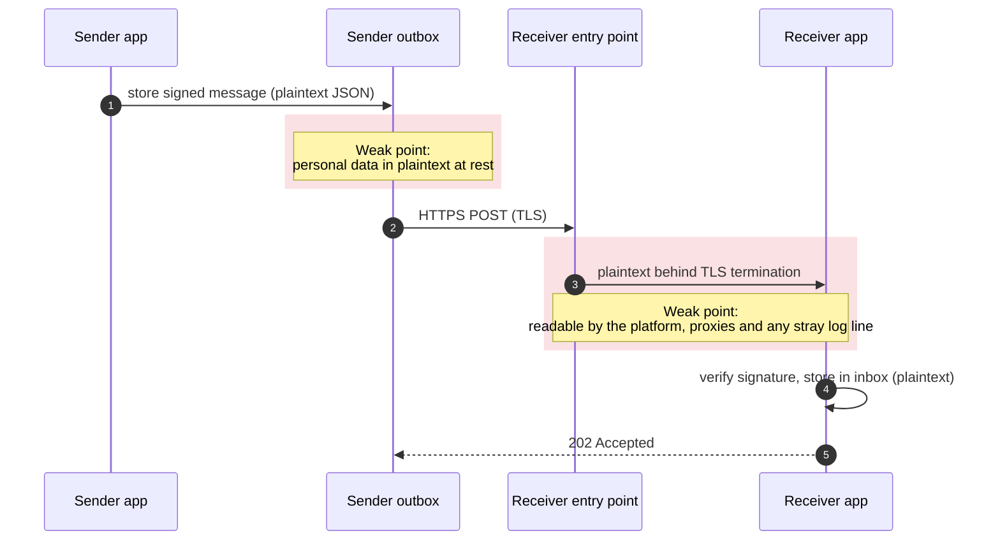
```mermaid
sequenceDiagram
    autonumber
    participant SA as Sender app
    participant SO as Sender outbox
    participant RI as Receiver entry point
    participant RA as Receiver app
    SA->>SO: store signed message (plaintext JSON)
    rect rgba(220, 53, 69, 0.15)
    Note over SO: Weak point:<br/>personal data in plaintext at rest
    end
    SO->>RI: HTTPS POST (TLS)
    rect rgba(220, 53, 69, 0.15)
    RI->>RA: plaintext behind TLS termination
    Note over RI,RA: Weak point:<br/>readable by the platform, proxies and any stray log line
    end
    RA->>RA: verify signature, store in inbox (plaintext)
    RA-->>SO: 202 Accepted
```

**Option 2: mutual TLS.** Authenticates the connection, adds no
confidentiality.

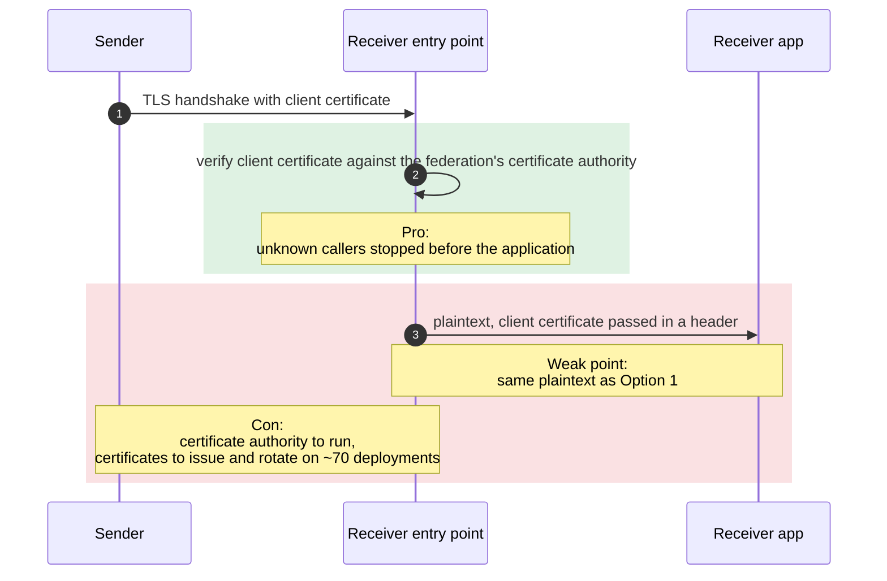
```mermaid
sequenceDiagram
    autonumber
    participant S as Sender
    participant RI as Receiver entry point
    participant RA as Receiver app
    S->>RI: TLS handshake with client certificate
    rect rgba(40, 167, 69, 0.15)
    RI->>RI: verify client certificate against the federation's certificate authority
    Note over RI: Pro:<br/>unknown callers stopped before the application
    end
    rect rgba(220, 53, 69, 0.15)
    RI->>RA: plaintext, client certificate passed in a header
    Note over RI,RA: Weak point:<br/>same plaintext as Option 1
    Note over S,RI: Con:<br/>certificate authority to run,<br/>certificates to issue and rotate on ~70 deployments
    end
```

**Option 3: sign, then encrypt.** The sender signs first, so the signature
covers the plaintext and can be kept for the audit after decryption. The
receiver's ID is inside the signed content, so a receiver cannot pass a
valid message on to a third participant as if it had been sent there. The
outbox keeps the signed message encrypted under the sender's own key and
encrypts it to the receiver's current key on every attempt, so a key
rotation at the receiver does not strand queued messages (AD-26).

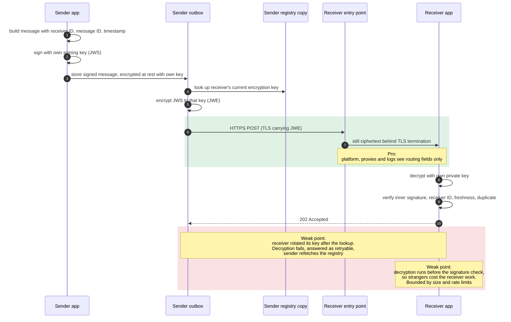
```mermaid
sequenceDiagram
    autonumber
    participant SA as Sender app
    participant SO as Sender outbox
    participant RG as Sender registry copy
    participant RI as Receiver entry point
    participant RA as Receiver app
    SA->>SA: build message with receiver ID, message ID, timestamp
    SA->>SA: sign with own signing key (JWS)
    SA->>SO: store signed message, encrypted at rest with own key
    SO->>RG: look up receiver's current encryption key
    SO->>SO: encrypt JWS to that key (JWE)
    rect rgba(40, 167, 69, 0.15)
    SO->>RI: HTTPS POST (TLS carrying JWE)
    RI->>RA: still ciphertext behind TLS termination
    Note over RI,RA: Pro:<br/>platform, proxies and logs see routing fields only
    end
    RA->>RA: decrypt with own private key
    RA->>RA: verify inner signature, receiver ID, freshness, duplicate
    RA-->>SO: 202 Accepted
    rect rgba(220, 53, 69, 0.15)
    Note over SO,RA: Weak point:<br/>receiver rotated its key after the lookup.<br/>Decryption fails, answered as retryable,<br/>sender refetches the registry
    Note over RA: Weak point:<br/>decryption runs before the signature check,<br/>so strangers cost the receiver work.<br/>Bounded by size and rate limits
    end
```

A variant adds an outer signature over the JWE (sign, encrypt, sign) so
strangers are rejected before decryption; at the volumes of NFR-09 it is
not needed.

**Option 4: HPKE.** Same flow as Option 3 with a different encryption
construction; the envelope around it would be our own format.

## AD-25 Algorithms and storage of participant keys

**Option 1: keys in the application.**

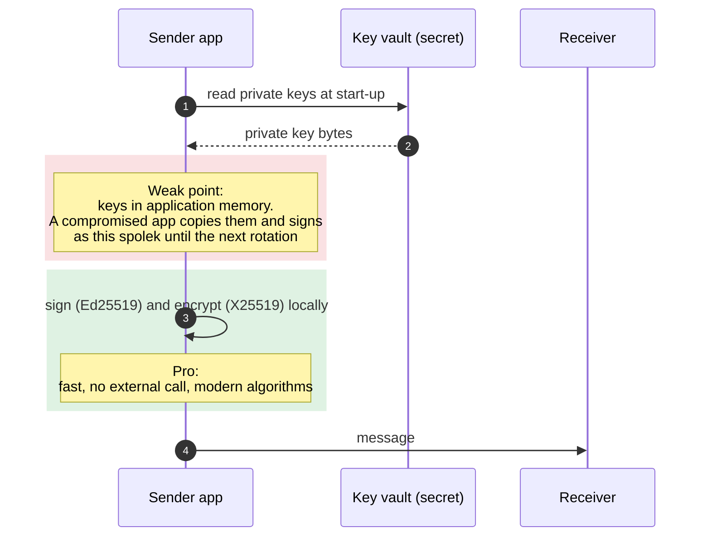
```mermaid
sequenceDiagram
    autonumber
    participant A as Sender app
    participant KV as Key vault (secret)
    participant R as Receiver
    A->>KV: read private keys at start-up
    KV-->>A: private key bytes
    rect rgba(220, 53, 69, 0.15)
    Note over A: Weak point:<br/>keys in application memory.<br/>A compromised app copies them and signs<br/>as this spolek until the next rotation
    end
    rect rgba(40, 167, 69, 0.15)
    A->>A: sign (Ed25519) and encrypt (X25519) locally
    Note over A: Pro:<br/>fast, no external call, modern algorithms
    end
    A->>R: message
```

**Option 2: keys inside the vault.** The sender encrypts locally with the
receiver's public key; only signing and unwrapping need the vault.

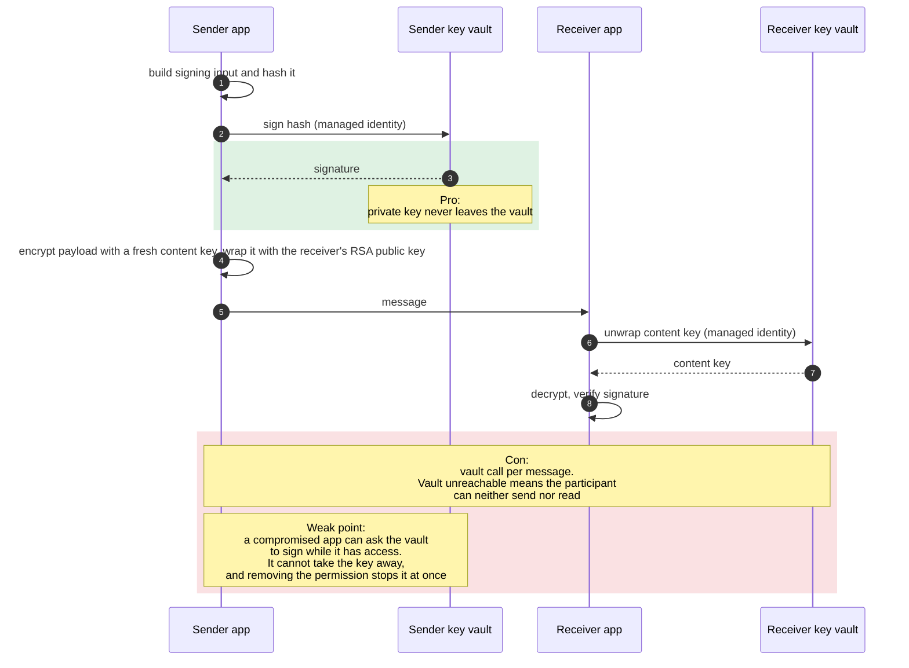
```mermaid
sequenceDiagram
    autonumber
    participant A as Sender app
    participant KV as Sender key vault
    participant R as Receiver app
    participant KR as Receiver key vault
    A->>A: build signing input and hash it
    A->>KV: sign hash (managed identity)
    rect rgba(40, 167, 69, 0.15)
    KV-->>A: signature
    Note over KV: Pro:<br/>private key never leaves the vault
    end
    A->>A: encrypt payload with a fresh content key, wrap it with the receiver's RSA public key
    A->>R: message
    R->>KR: unwrap content key (managed identity)
    KR-->>R: content key
    R->>R: decrypt, verify signature
    rect rgba(220, 53, 69, 0.15)
    Note over A,KR: Con:<br/>vault call per message.<br/>Vault unreachable means the participant<br/>can neither send nor read
    Note over A,KV: Weak point:<br/>a compromised app can ask the vault<br/>to sign while it has access.<br/>It cannot take the key away,<br/>and removing the permission stops it at once
    end
```

**Option 3: identity key certifies operational keys.**

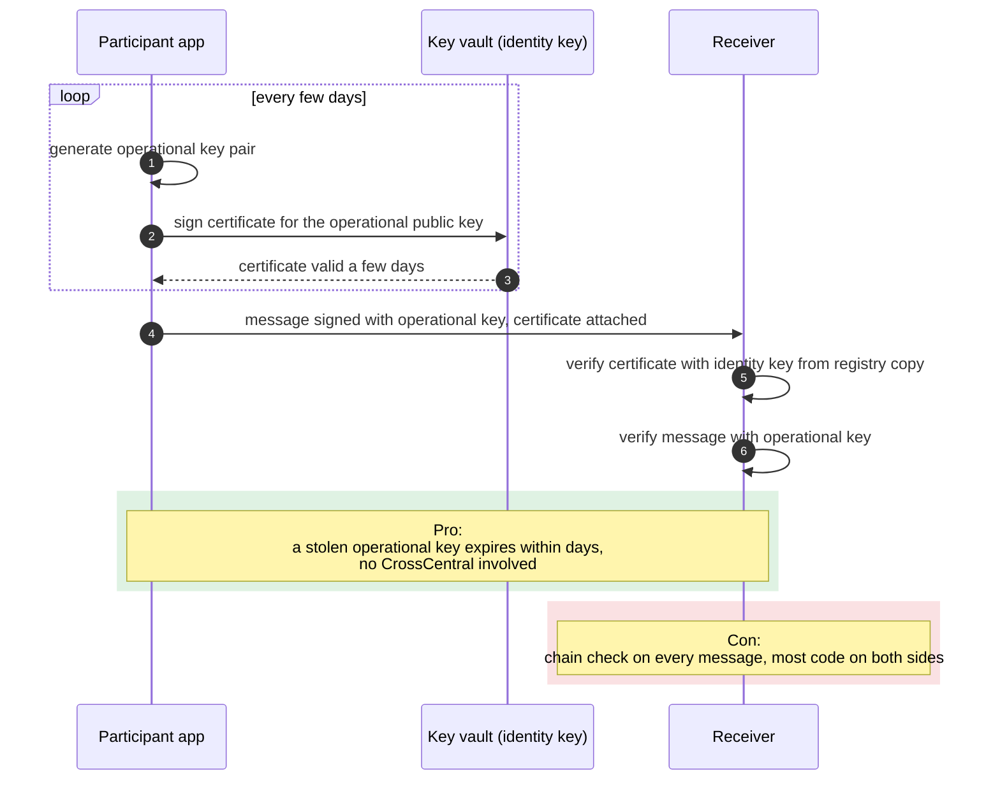
```mermaid
sequenceDiagram
    autonumber
    participant A as Participant app
    participant KV as Key vault (identity key)
    participant R as Receiver
    loop every few days
        A->>A: generate operational key pair
        A->>KV: sign certificate for the operational public key
        KV-->>A: certificate valid a few days
    end
    A->>R: message signed with operational key, certificate attached
    R->>R: verify certificate with identity key from registry copy
    R->>R: verify message with operational key
    rect rgba(40, 167, 69, 0.15)
    Note over A,R: Pro:<br/>a stolen operational key expires within days,<br/>no CrossCentral involved
    end
    rect rgba(220, 53, 69, 0.15)
    Note over R: Con:<br/>chain check on every message, most code on both sides
    end
```

## AD-26 Rotation of participant keys

**Proposed intervals.** Encryption keys about 30 days, signing keys about
90 days, overlap at least the AD-32 hard limit (e.g. 14 days). Rotating
encryption keys often and destroying old private keys gives a practical
form of forward secrecy: once a key is destroyed, ciphertexts captured
under it cannot be decrypted, even by someone who later breaks into the
participant.

**Option 2: regular rollover.**

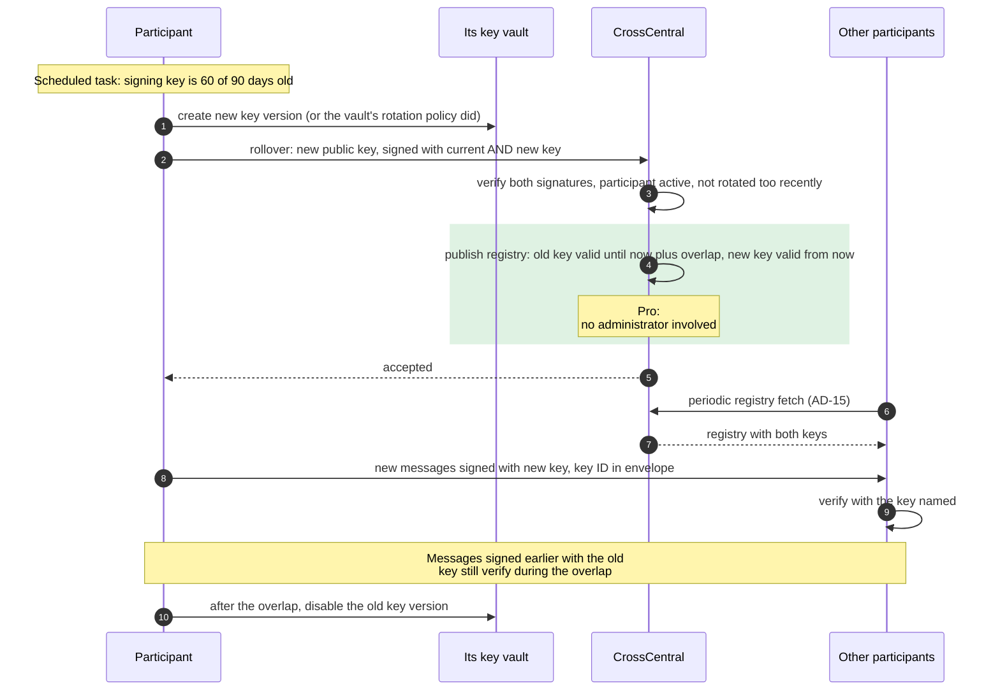
```mermaid
sequenceDiagram
    autonumber
    participant P as Participant
    participant KV as Its key vault
    participant CC as CrossCentral
    participant Q as Other participants
    Note over P: Scheduled task: signing key is 60 of 90 days old
    P->>KV: create new key version (or the vault's rotation policy did)
    P->>CC: rollover: new public key, signed with current AND new key
    CC->>CC: verify both signatures, participant active, not rotated too recently
    rect rgba(40, 167, 69, 0.15)
    CC->>CC: publish registry: old key valid until now plus overlap, new key valid from now
    Note over CC: Pro:<br/>no administrator involved
    end
    CC-->>P: accepted
    Q->>CC: periodic registry fetch (AD-15)
    CC-->>Q: registry with both keys
    P->>Q: new messages signed with new key, key ID in envelope
    Q->>Q: verify with the key named
    Note over P,Q: Messages signed earlier with the old<br/>key still verify during the overlap
    P->>KV: after the overlap, disable the old key version
```

**Option 2 when CrossCentral is down.** The rollover is retried by the
scheduled task; the participant keeps using its current key, which is
still valid because rotation starts well before its validity runs out
(e.g. at 60 of 90 days). Only a key that reaches its end of validity
without a successful rollover alerts the administrators.

**Option 2 weak point: a stolen current key.**

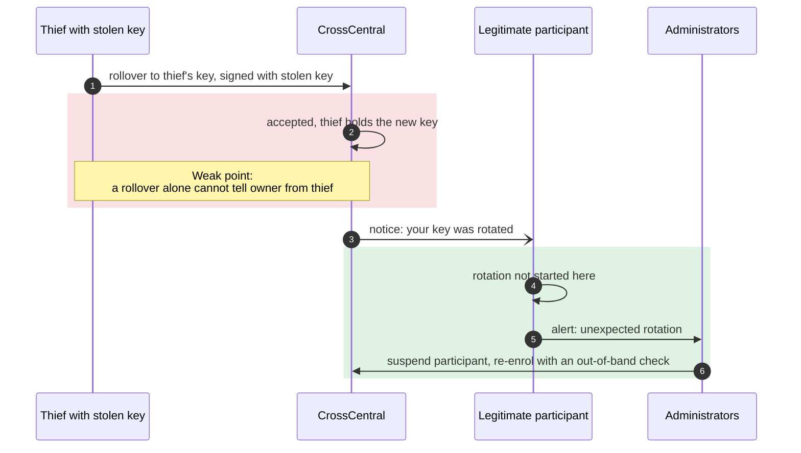
```mermaid
sequenceDiagram
    autonumber
    participant T as Thief with stolen key
    participant CC as CrossCentral
    participant P as Legitimate participant
    participant Ad as Administrators
    T->>CC: rollover to thief's key, signed with stolen key
    rect rgba(220, 53, 69, 0.15)
    CC->>CC: accepted, thief holds the new key
    Note over T,CC: Weak point:<br/>a rollover alone cannot tell owner from thief
    end
    CC-)P: notice: your key was rotated
    rect rgba(40, 167, 69, 0.15)
    P->>P: rotation not started here
    P->>Ad: alert: unexpected rotation
    Ad->>CC: suspend participant, re-enrol with an out-of-band check
    end
```

The owner also notices at its next message or rollover, which CrossCentral
rejects. With AD-25 Option 2 the key cannot be copied in the first place,
only misused while the attacker controls the application.

**Option 3: certificates from CrossCentral.**

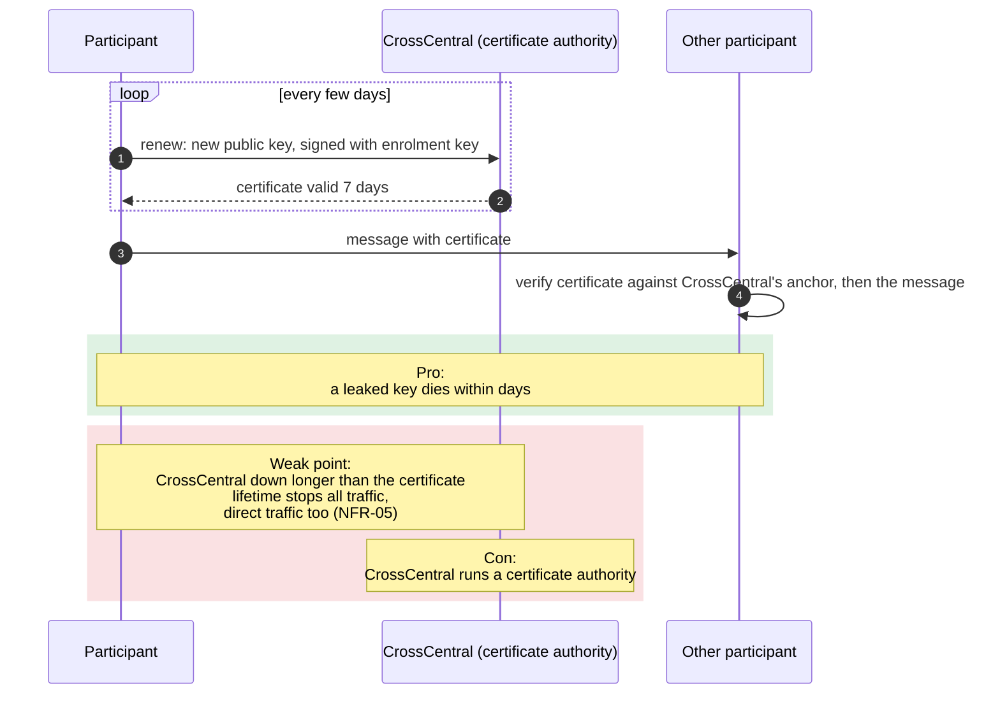
```mermaid
sequenceDiagram
    autonumber
    participant P as Participant
    participant CC as CrossCentral (certificate authority)
    participant Q as Other participant
    loop every few days
        P->>CC: renew: new public key, signed with enrolment key
        CC-->>P: certificate valid 7 days
    end
    P->>Q: message with certificate
    Q->>Q: verify certificate against CrossCentral's anchor, then the message
    rect rgba(40, 167, 69, 0.15)
    Note over P,Q: Pro:<br/>a leaked key dies within days
    end
    rect rgba(220, 53, 69, 0.15)
    Note over P,CC: Weak point:<br/>CrossCentral down longer than the certificate<br/>lifetime stops all traffic,<br/>direct traffic too (NFR-05)
    Note over CC: Con:<br/>CrossCentral runs a certificate authority
    end
```

**Option 4** works as shown for AD-25 Option 3.

## AD-27 Rotation of the trust anchor

**Option 2: key continuity.**

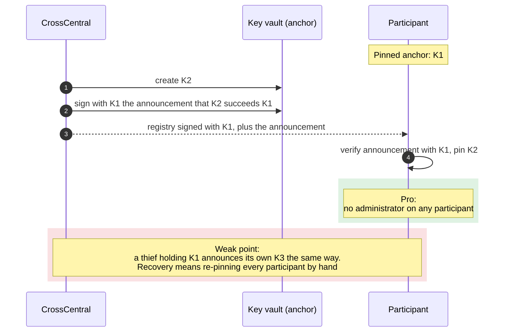
```mermaid
sequenceDiagram
    autonumber
    participant CC as CrossCentral
    participant KV as Key vault (anchor)
    participant P as Participant
    Note over P: Pinned anchor: K1
    CC->>KV: create K2
    CC->>KV: sign with K1 the announcement that K2 succeeds K1
    CC-->>P: registry signed with K1, plus the announcement
    P->>P: verify announcement with K1, pin K2
    rect rgba(40, 167, 69, 0.15)
    Note over P: Pro:<br/>no administrator on any participant
    end
    rect rgba(220, 53, 69, 0.15)
    Note over CC,P: Weak point:<br/>a thief holding K1 announces its own K3 the same way.<br/>Recovery means re-pinning every participant by hand
    end
```

**Option 3: root and online key.**

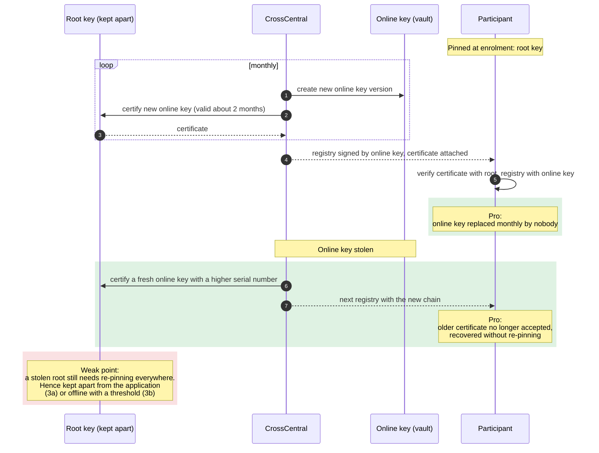
```mermaid
sequenceDiagram
    autonumber
    participant RK as Root key (kept apart)
    participant CC as CrossCentral
    participant OK as Online key (vault)
    participant P as Participant
    Note over P: Pinned at enrolment: root key
    loop monthly
        CC->>OK: create new online key version
        CC->>RK: certify new online key (valid about 2 months)
        RK-->>CC: certificate
    end
    CC-->>P: registry signed by online key, certificate attached
    P->>P: verify certificate with root, registry with online key
    rect rgba(40, 167, 69, 0.15)
    Note over P: Pro:<br/>online key replaced monthly by nobody
    end
    Note over CC,OK: Online key stolen
    rect rgba(40, 167, 69, 0.15)
    CC->>RK: certify a fresh online key with a higher serial number
    CC-->>P: next registry with the new chain
    Note over P: Pro:<br/>older certificate no longer accepted,<br/>recovered without re-pinning
    end
    rect rgba(220, 53, 69, 0.15)
    Note over RK: Weak point:<br/>a stolen root still needs re-pinning everywhere.<br/>Hence kept apart from the application<br/>(3a) or offline with a threshold (3b)
    end
```

## AD-28 Definition of request kinds

**Option 2: shared definitions.**

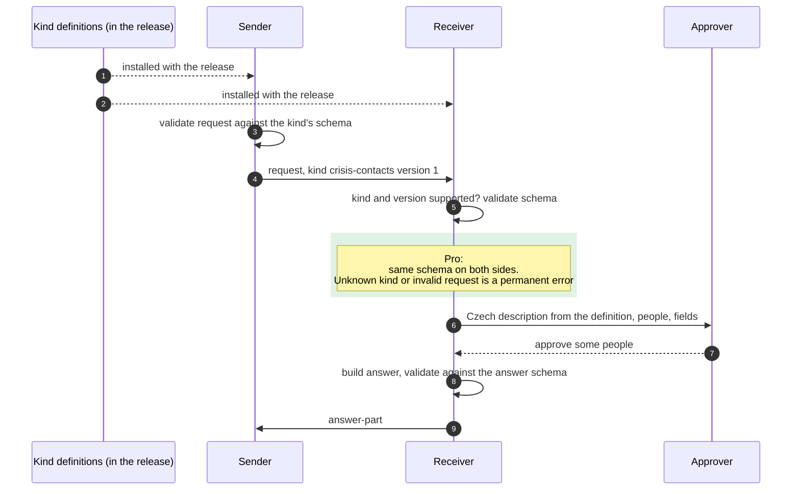
```mermaid
sequenceDiagram
    autonumber
    participant D as Kind definitions (in the release)
    participant S as Sender
    participant R as Receiver
    participant Ap as Approver
    D-->>S: installed with the release
    D-->>R: installed with the release
    S->>S: validate request against the kind's schema
    S->>R: request, kind crisis-contacts version 1
    R->>R: kind and version supported? validate schema
    rect rgba(40, 167, 69, 0.15)
    Note over R: Pro:<br/>same schema on both sides.<br/>Unknown kind or invalid request is a permanent error
    end
    R->>Ap: Czech description from the definition, people, fields
    Ap-->>R: approve some people
    R->>R: build answer, validate against the answer schema
    R->>S: answer-part
```

**Option 3: kinds pushed at runtime.**

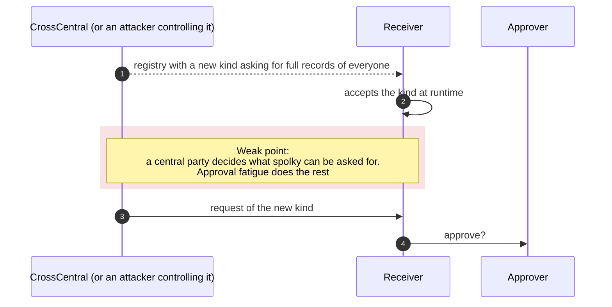
```mermaid
sequenceDiagram
    autonumber
    participant CC as CrossCentral (or an attacker controlling it)
    participant R as Receiver
    participant Ap as Approver
    CC-->>R: registry with a new kind asking for full records of everyone
    R->>R: accepts the kind at runtime
    rect rgba(220, 53, 69, 0.15)
    Note over CC,R: Weak point:<br/>a central party decides what spolky can be asked for.<br/>Approval fatigue does the rest
    end
    CC->>R: request of the new kind
    R->>Ap: approve?
```

## AD-29 Outbox storage in MemberBase

**Option 1a: crash between the two writes.**

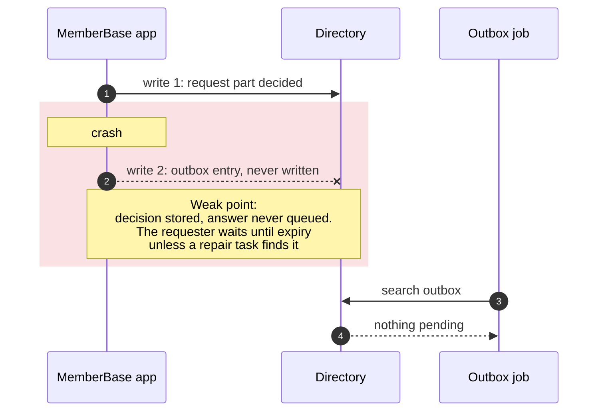
```mermaid
sequenceDiagram
    autonumber
    participant A as MemberBase app
    participant L as Directory
    participant J as Outbox job
    A->>L: write 1: request part decided
    rect rgba(220, 53, 69, 0.15)
    Note over A: crash
    A--xL: write 2: outbox entry, never written
    Note over A,L: Weak point:<br/>decision stored, answer never queued.<br/>The requester waits until expiry<br/>unless a repair task finds it
    end
    J->>L: search outbox
    L-->>J: nothing pending
```

**Option 1b: one write.** A crash after the receiver's `202` and before
the pending attributes are cleared only sends the message again, which the
receiver ignores as a duplicate.

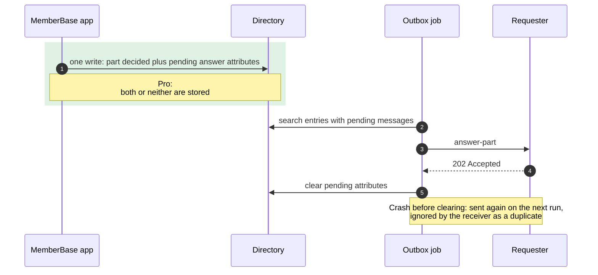
```mermaid
sequenceDiagram
    autonumber
    participant A as MemberBase app
    participant L as Directory
    participant J as Outbox job
    participant R as Requester
    rect rgba(40, 167, 69, 0.15)
    A->>L: one write: part decided plus pending answer attributes
    Note over A,L: Pro:<br/>both or neither are stored
    end
    J->>L: search entries with pending messages
    J->>R: answer-part
    R-->>J: 202 Accepted
    J->>L: clear pending attributes
    Note over J,R: Crash before clearing: sent again on the next run,<br/>ignored by the receiver as a duplicate
```

**Option 2** has the same gap as Option 1a, between the directory write and
putting the message on the queue.

## AD-30 Sending and retries

**Option 1: job only.**

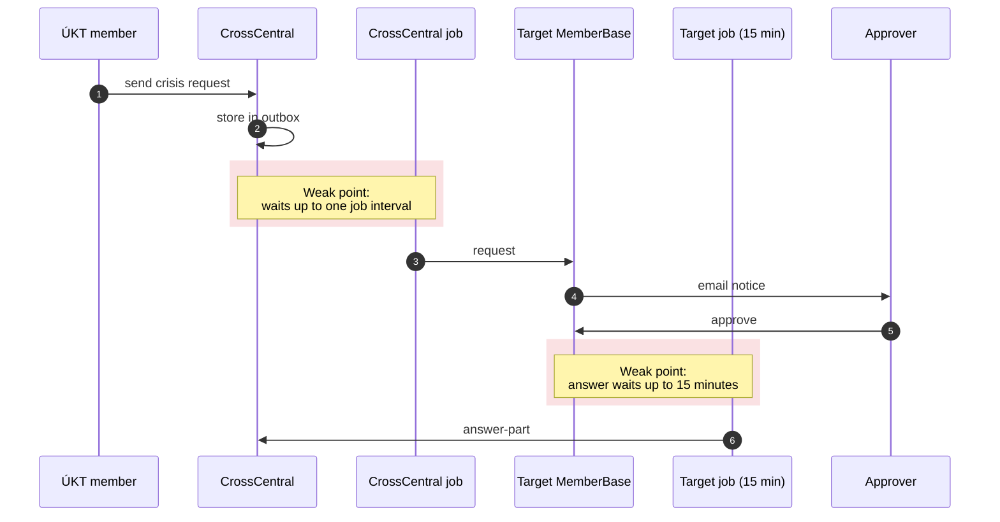
```mermaid
sequenceDiagram
    autonumber
    participant U as ÚKT member
    participant CC as CrossCentral
    participant J as CrossCentral job
    participant R as Target MemberBase
    participant RJ as Target job (15 min)
    participant Ap as Approver
    U->>CC: send crisis request
    CC->>CC: store in outbox
    rect rgba(220, 53, 69, 0.15)
    Note over CC,J: Weak point:<br/>waits up to one job interval
    end
    J->>R: request
    R->>Ap: email notice
    Ap->>R: approve
    rect rgba(220, 53, 69, 0.15)
    Note over R,RJ: Weak point:<br/>answer waits up to 15 minutes
    end
    RJ->>CC: answer-part
```

**Option 2: immediate attempt, job retries.**

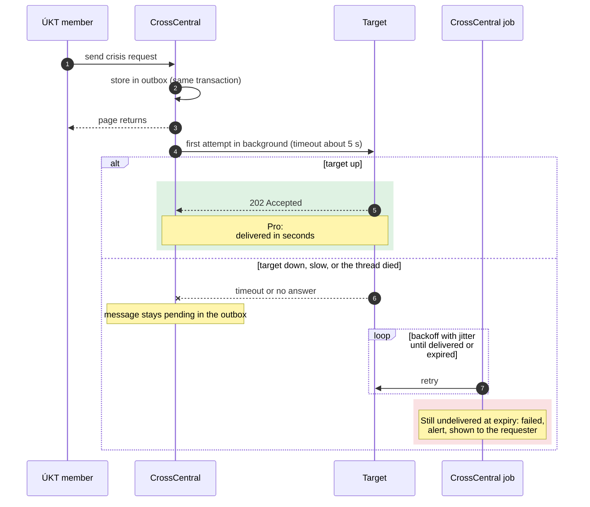
```mermaid
sequenceDiagram
    autonumber
    participant U as ÚKT member
    participant CC as CrossCentral
    participant R as Target
    participant J as CrossCentral job
    U->>CC: send crisis request
    CC->>CC: store in outbox (same transaction)
    CC-->>U: page returns
    CC->>R: first attempt in background (timeout about 5 s)
    alt target up
        rect rgba(40, 167, 69, 0.15)
        R-->>CC: 202 Accepted
        Note over CC,R: Pro:<br/>delivered in seconds
        end
    else target down, slow, or the thread died
        R--xCC: timeout or no answer
        Note over CC: message stays pending in the outbox
        loop backoff with jitter until delivered or expired
            J->>R: retry
        end
        rect rgba(220, 53, 69, 0.15)
        Note over J: Still undelivered at expiry: failed,<br/>alert, shown to the requester
        end
    end
```

## AD-31 Reconciliation after lost messages

**Sender restored from backup.**

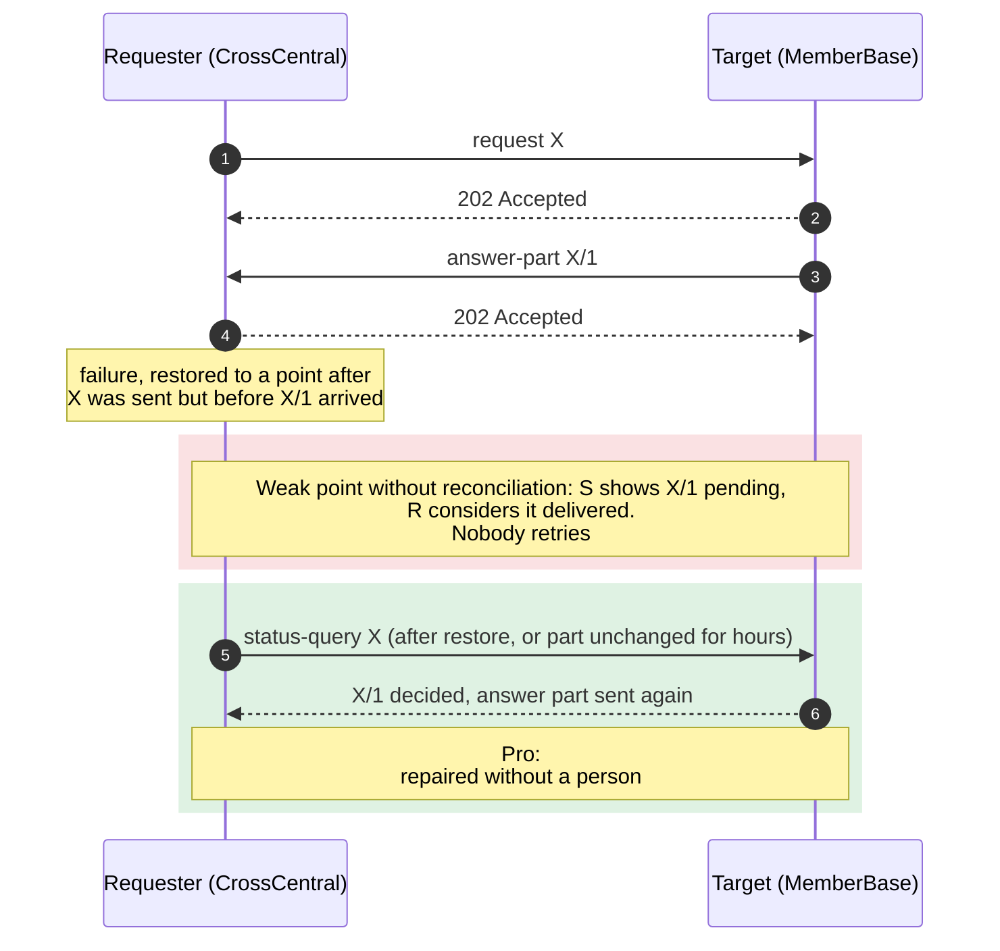
```mermaid
sequenceDiagram
    autonumber
    participant S as Requester (CrossCentral)
    participant R as Target (MemberBase)
    S->>R: request X
    R-->>S: 202 Accepted
    R->>S: answer-part X/1
    S-->>R: 202 Accepted
    Note over S: failure, restored to a point after<br/>X was sent but before X/1 arrived
    rect rgba(220, 53, 69, 0.15)
    Note over S,R: Weak point without reconciliation: S shows X/1 pending,<br/>R considers it delivered.<br/>Nobody retries
    end
    rect rgba(40, 167, 69, 0.15)
    S->>R: status-query X (after restore, or part unchanged for hours)
    R-->>S: X/1 decided, answer part sent again
    Note over S,R: Pro:<br/>repaired without a person
    end
```

**Receiver restored from backup.**

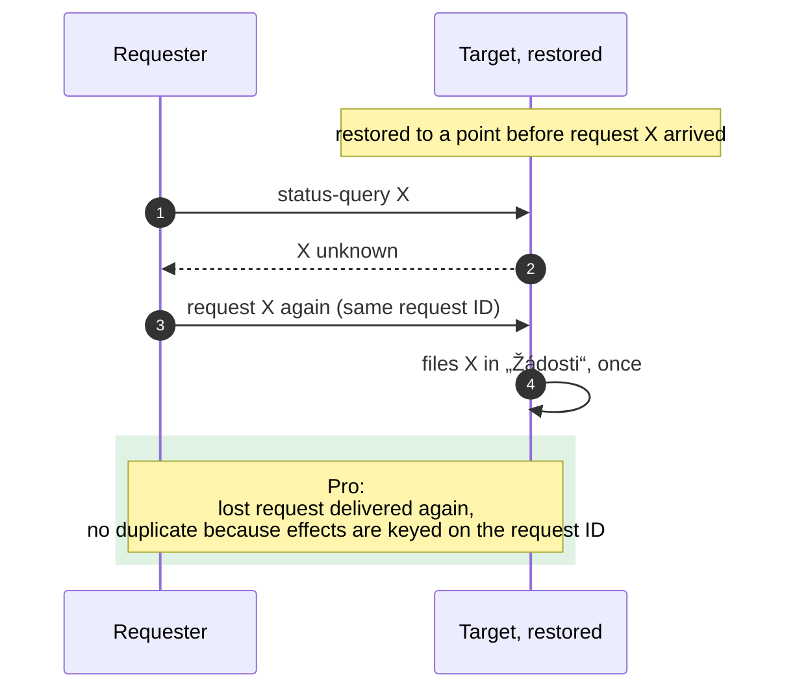
```mermaid
sequenceDiagram
    autonumber
    participant S as Requester
    participant R as Target, restored
    Note over R: restored to a point before request X arrived
    S->>R: status-query X
    R-->>S: X unknown
    S->>R: request X again (same request ID)
    R->>R: files X in „Žádosti“, once
    rect rgba(40, 167, 69, 0.15)
    Note over S,R: Pro:<br/>lost request delivered again,<br/>no duplicate because effects are keyed on the request ID
    end
```

## AD-32 Stale registry copy

**Freeze attack.**

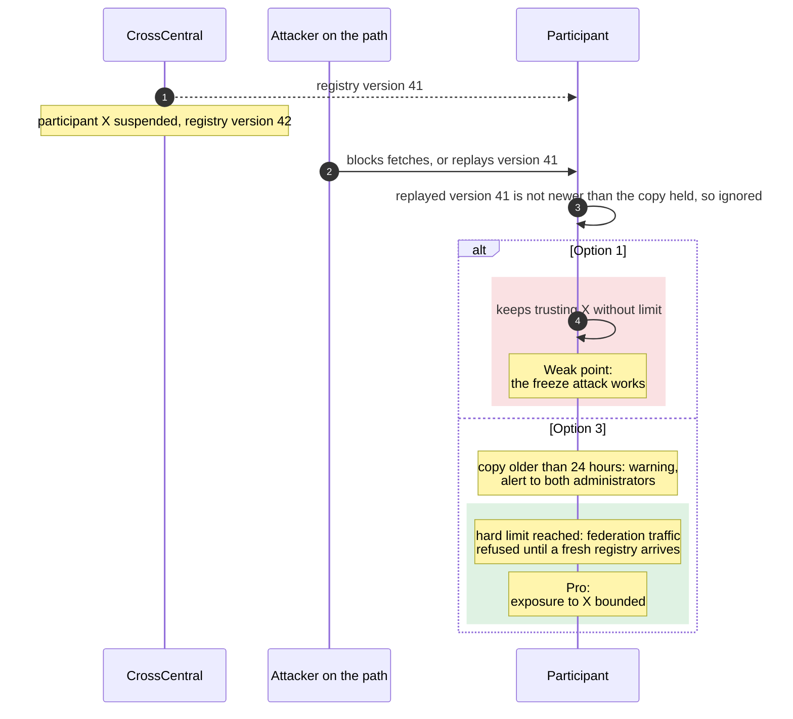
```mermaid
sequenceDiagram
    autonumber
    participant CC as CrossCentral
    participant At as Attacker on the path
    participant P as Participant
    CC-->>P: registry version 41
    Note over CC: participant X suspended, registry version 42
    At->>P: blocks fetches, or replays version 41
    P->>P: replayed version 41 is not newer than the copy held, so ignored
    alt Option 1
        rect rgba(220, 53, 69, 0.15)
        P->>P: keeps trusting X without limit
        Note over P: Weak point:<br/>the freeze attack works
        end
    else Option 3
        Note over P: copy older than 24 hours: warning,<br/>alert to both administrators
        rect rgba(40, 167, 69, 0.15)
        Note over P: hard limit reached: federation traffic<br/>refused until a fresh registry arrives
        Note over P: Pro:<br/>exposure to X bounded
        end
    end
```

**CrossCentral down for a long time.**

```mermaid
sequenceDiagram
    autonumber
    participant CC as CrossCentral
    participant P as Participant A
    participant Q as Participant B
    Note over CC: outage
    P->>Q: direct requests continue with the last copy
    Note over P,Q: after 24 hours: warning, administrators alerted
    rect rgba(220, 53, 69, 0.15)
    Note over P,Q: Weak point (Options 2 and 3): after the<br/>hard limit even direct traffic stops,<br/>until CrossCentral is back
    end
```

## AD-33 Order of messages

**Late status after an answer part.**

```mermaid
sequenceDiagram
    autonumber
    participant S as Requester
    participant R as Target
    R--xS: status pending, sent first (lost, retried later)
    R->>S: answer-part, sent second
    alt Option 1, sequence numbers
        rect rgba(220, 53, 69, 0.15)
        S->>S: holds back the answer-part until the status arrives
        Note over S: Weak point:<br/>answer invisible until the retry succeeds.<br/>If R stays down, blocked until expiry
        end
        R->>S: status pending (retry)
        S->>S: apply status, then answer-part
    else Option 2, state only moves forward
        rect rgba(40, 167, 69, 0.15)
        S->>S: apply answer-part: part answered
        Note over S: Pro:<br/>answer usable at once
        end
        R->>S: status pending (retry)
        S->>S: would move the state back, ignored
    end
```

**Cancel before request (Option 2).**

```mermaid
sequenceDiagram
    autonumber
    participant S as Requester
    participant R as Target
    S--xR: request X (lost, retried later)
    S->>R: cancel X
    R->>R: X unknown, keep a cancel marker for X
    S->>R: request X (retry)
    rect rgba(40, 167, 69, 0.15)
    R->>R: marker found, X not filed
    Note over R: Pro:<br/>a cancelled request never reaches an approver
    end
```

## AD-34 Approvers who do not act

```mermaid
sequenceDiagram
    autonumber
    participant CC as Requester
    participant R as Target MemberBase
    participant Ch as MS Chair
    participant DC as District Coordinator
    CC->>R: crisis request, expiry 24 hours
    R->>Ch: notice
    Note over R: 6 hours, no decision
    R->>Ch: reminder (Options 2 and 3)
    alt Option 3, urgent kind
        Note over R: 8 hours, still no decision
        R->>DC: escalation: you may decide this part
        DC->>R: approve
        rect rgba(40, 167, 69, 0.15)
        R->>CC: answer-part, decided by the District Coordinator
        Note over CC,R: Pro:<br/>answer despite an absent Chair
        end
        Ch->>R: tries to decide later
        R-->>Ch: already decided
    else Option 1 or 2
        rect rgba(220, 53, 69, 0.15)
        Note over R: 24 hours: part expires unanswered
        end
    end
```
